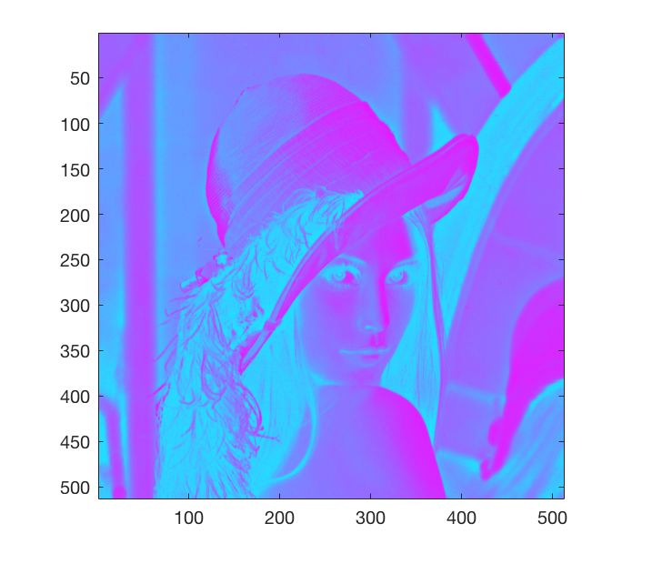
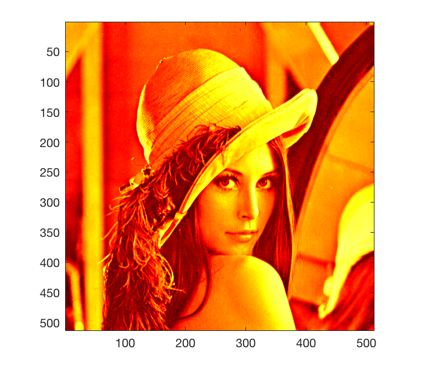
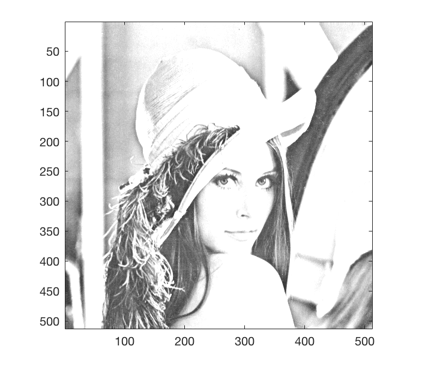
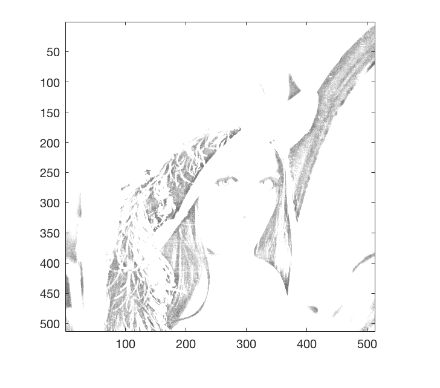
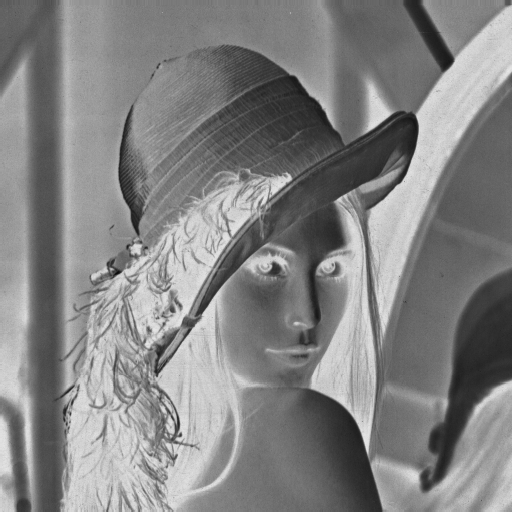
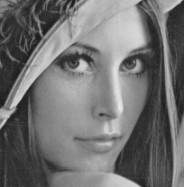
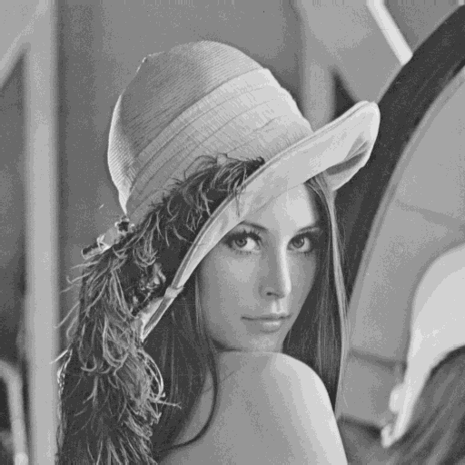

#Image and Video Processing (EEE412- Lab 01) 
#### *Sep 29 2017*

## Task 01
###1.Display image with color-map and explain.

####1.1 Color-map set to cool(256).
The result shows like this:


By run following code in matlab, set the color-map to cool:

``` matlab
img = imread('lenna512.bmp');
figure;
image(img)

colormap cool(256);
truesize;
```


####1.2 Color-map set to hot(255).
The result shows like this:


By run following code in matlab, set the color-map to hot:

``` matlab
img = imread('lenna512.bmp');
figure;
image(img)

colormap hot(255);
truesize;
```


####1.3 Color-map set to gray(128).

The result shows like this:


With following code in matlab, set the color-map to gray(128):

``` matlab
img = imread('lenna512.bmp');
figure;
image(img)

colormap gray(128);
truesize;
```

####1.4 Color-map set to gray(64).
The result shows like this:


With following code in matlab, set the color-map to gray(64):

``` matlab
img = imread('lenna512.bmp');
figure;
image(img)

colormap gray(64);
truesize;
```

###2.Modify the color-map to display the image as negative.
With the following  matlab code, manipulate each cell of the image matrices with the formula f(x) = 255- x to get the inverted image:

```
img = imread('lenna512.bmp');

% imfinfo('lenna512.bmp')
img_inversion = 255 - img;
figure;
imshow(img_inversion)
imwrite(img_inversion,'lenna_inversion.png');
```

Outcome is like this:



## Task 02
###1.Crop the face of the image Lenna.
Run the following code and use mouse drag select the face area to crop and save image:

```
img = imread('lenna512.bmp');

img_crop = imcrop(img);
figure;
imshow(img)
imwrite(img_crop,'lenna_crop.png');
```

Get saved crop image like:



###2.Down-sampling and up-sampling.
#### 2.a. Down-sampling using nearest neighbor interpolation.
Simply take the pixel at right down conner of 2*2 grid as mapped values, and asign them to new image matrices respectively.

```
img = imread('lenna512.bmp');
samplingRatio = 1/2;

[original_width,original_height] = size(img);
width = original_width * samplingRatio;
height = original_height * samplingRatio;

img_downSampling = uint8(zeros(width,height));

for y = 1:height
    for x = 1:width
        sample_x = round(x/samplingRatio);
        sample_y = round(y/samplingRatio);
        img_downSampling(x,y) = img(sample_x,sample_y);
    end
end

imwrite(img_downSampling,'lenna_downSampling.png');
    
```
With the above code the result shows like following:


#### 2.b.Up-sampling using nearest neighbor interpolation.
Directlyly use the pixel values from sample image and expand to 2*2 grids (simply duplicating, no mapping) and save matrices as new image. 

```
img = imread('lenna_downSampling.png');
samplingRatio = 2;

[original_width,original_height] = size(img);
width = original_width * samplingRatio;
height = original_height * samplingRatio;

img_upSampling = uint8(zeros(width,height));

for y = 1:height
    for x = 1:width
        sample_x = round(x/samplingRatio);
        sample_y = round(y/samplingRatio);
        img_upSampling(x,y) = img(sample_x,sample_y);
    end
end

imwrite(img_upSampling,'lenna_upSampling.png');
    
```
The result would be like this:

 

Comparing to the original lenna512.bmp file, it clearly shows details are lost during this down and up samping process, the image didn't remain its detail even though the resolution was gainned back.


#### 2.c.Down-sampling and Up-sampling using bilinear and bicubic interpolation.
With matlab build-in resize function,  run following code and get four pictures:

```
img = imread('lenna512.bmp');
downSamplingRatio = 1/2;
upSamplingRation = 2;

img_bilinear_downSamping = imresize(img,downSamplingRatio,'bilinear');
img_bicubic_downSamping = imresize(img,downSamplingRatio,'bicubic');

imwrite(img_b_downSamping,'lenna_bilinear_downSampling.png');
imwrite(img_bic_downSamping,'lenna_bicubic_downSampling.png');

img_bilinear_upSampling = imresize(img_bilinear_downSamping,upSamplingRation,'bilinear');
img_bicubic_upSampling = imresize(img_bicubic_downSamping,upSamplingRation,'bicubic');

imwrite(img_bilinear_upSampling,'lenna_bilinear_upSampling.png');
imwrite(img_bicubic_upSampling,'lenna_bicubic_upSampling.png');

```
Down-sampling with bilinear interpolation:


Up-sampling with bilinear interpolation:


Down-sampling with bicubic interpolation:


Up-sampling with bicubic interpolation:


Comparing the final results of near neighbor, bilinear, bicubic  interpolation, different methods definitely remain various levels of detail loss, and bicubic interpolation has the best perfomance meanwhile near neighbor interpolation keeps the least details among others.

#### 2.d.Calculate the psnr.
Load original image and manipulated images from previous tasks in, with following code: 

```
img = imread('lenna512.bmp');
img_nn_upSampling = imread('lenna_upSampling.png');
img_bilinear_upSampling = imread('lenna_bilinear_upSampling.png');
img_bicubic_upSampling = imread('lenna_bicubic_upSampling.png');

psnr_nn = psnr(img_nn_upSampling, img)
psnr_bilinear = psnr(img_bilinear_upSampling, img)
psnr_bicubic = psnr(img_bicubic_upSampling, img)
```

The result shows psnr for neighbor, bilinear, bicubic  interpolation are 28.2912, 31.3847, 34.0863 respectively, which also matches the intuitive visual effects.  

### 3.Reduce image Lenna to 16 values by quantization.
Use floor(img / 16) to get the quantizated color value,  the contrast is too low in this case  since the gray value are in [0,16). Then map the color value to [15,255] through formula: f(x) = 15*x + 15. 

```
img = imread('lenna512.bmp');

img_quantization = floor(img/16);
img_quantization = img_quantization*15 + 15

imwrite(img_quantization,'img_quantization.png')
```


Due to the limited color sample space, the image can longer remain a fine smooth gradient when it comes to color, especially brightness, changes. Instead, contours of different colors are obviously presented. 


