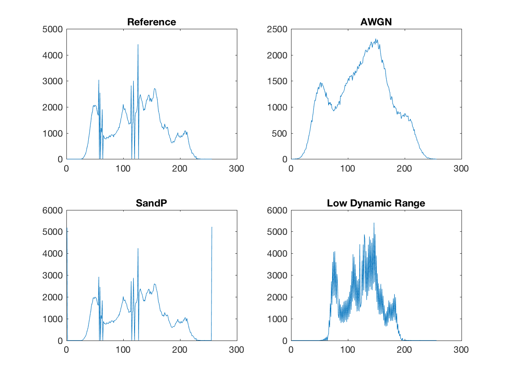
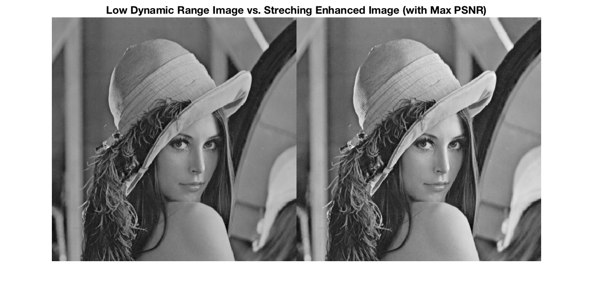
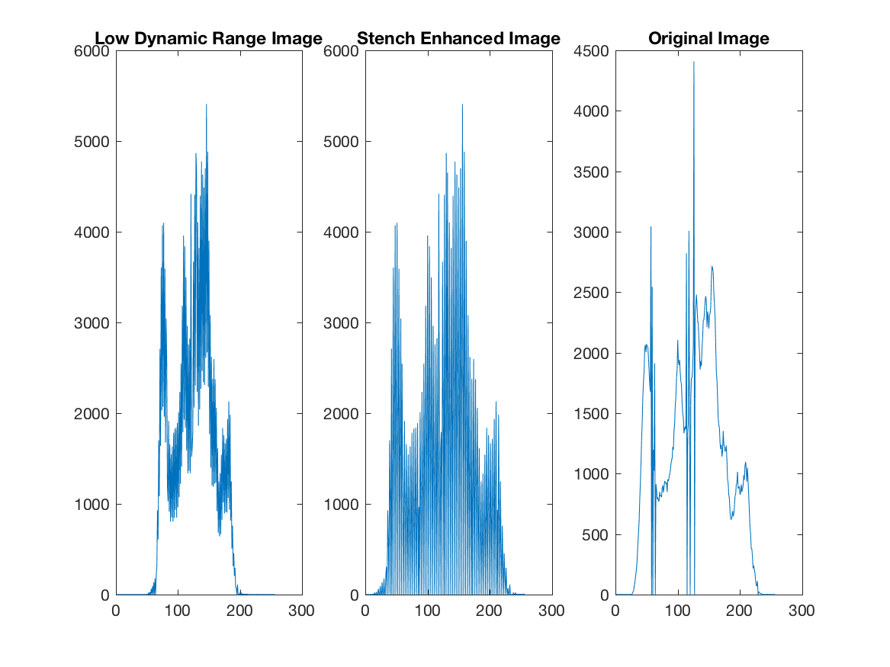
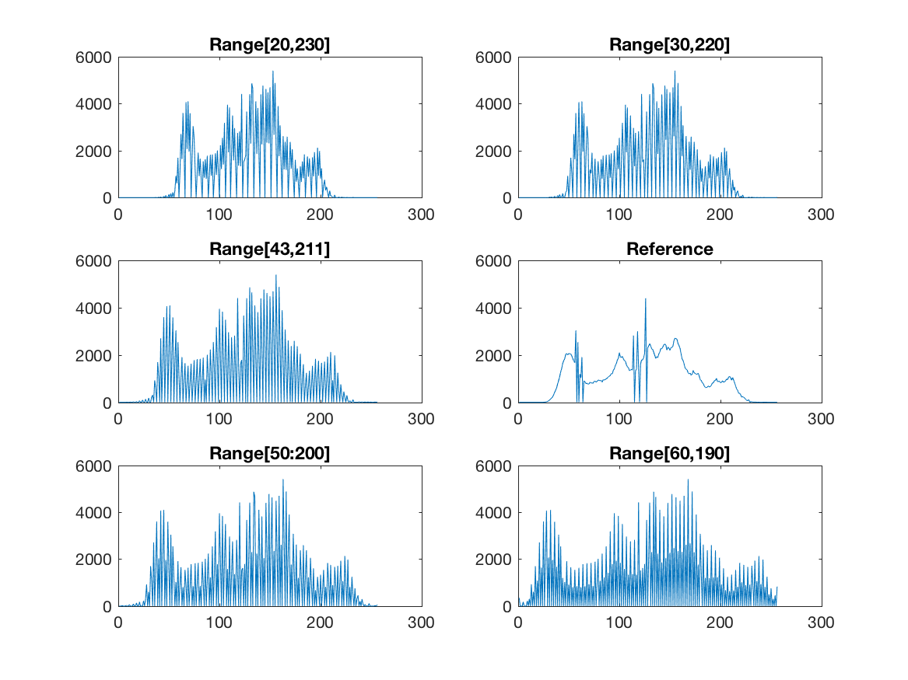
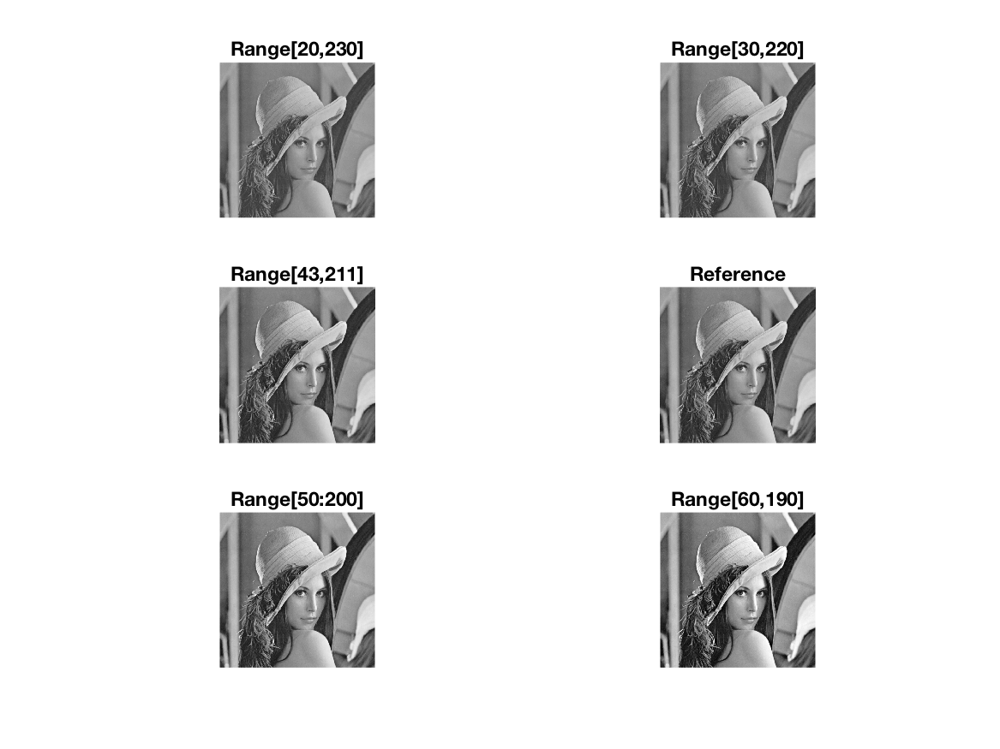
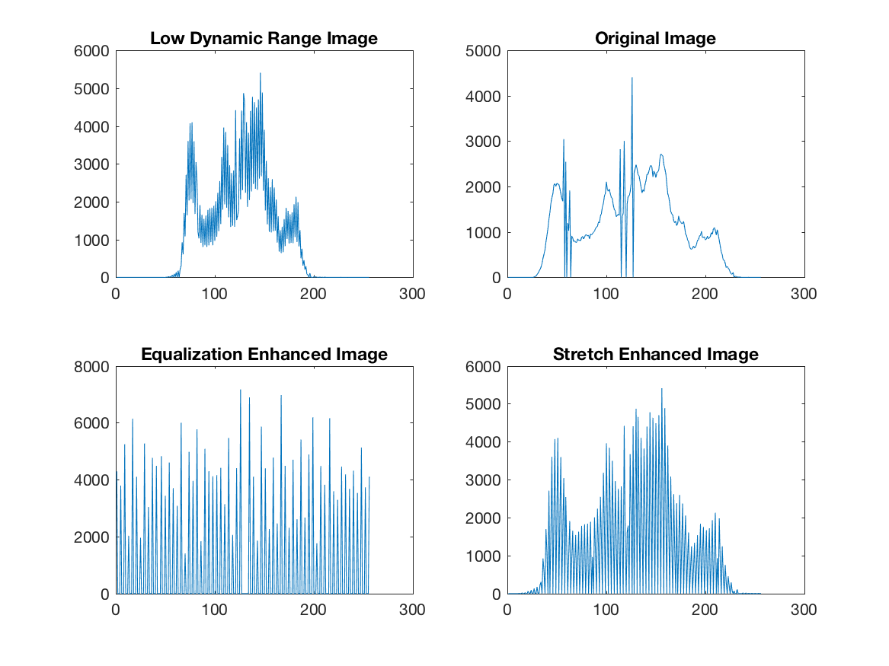
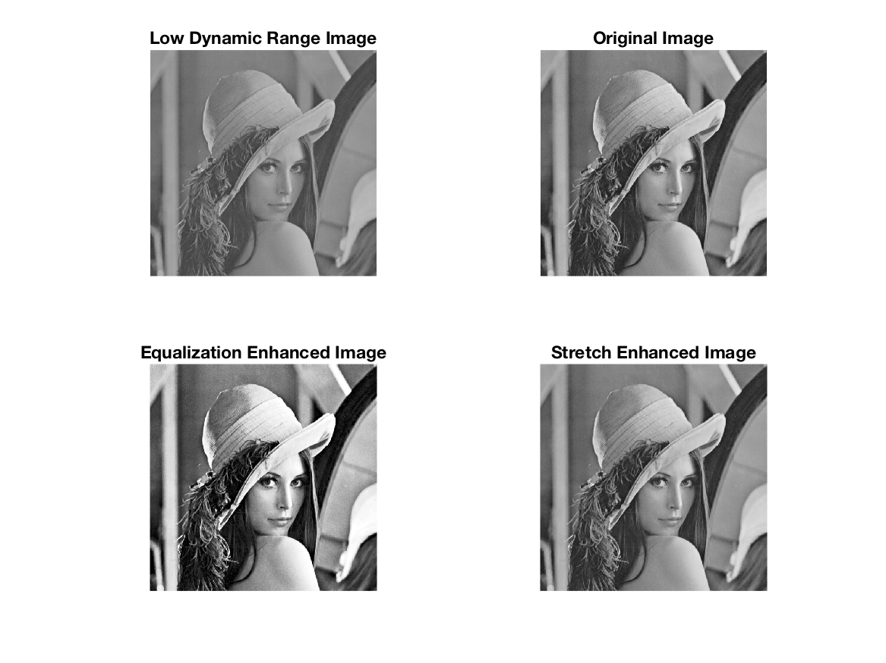
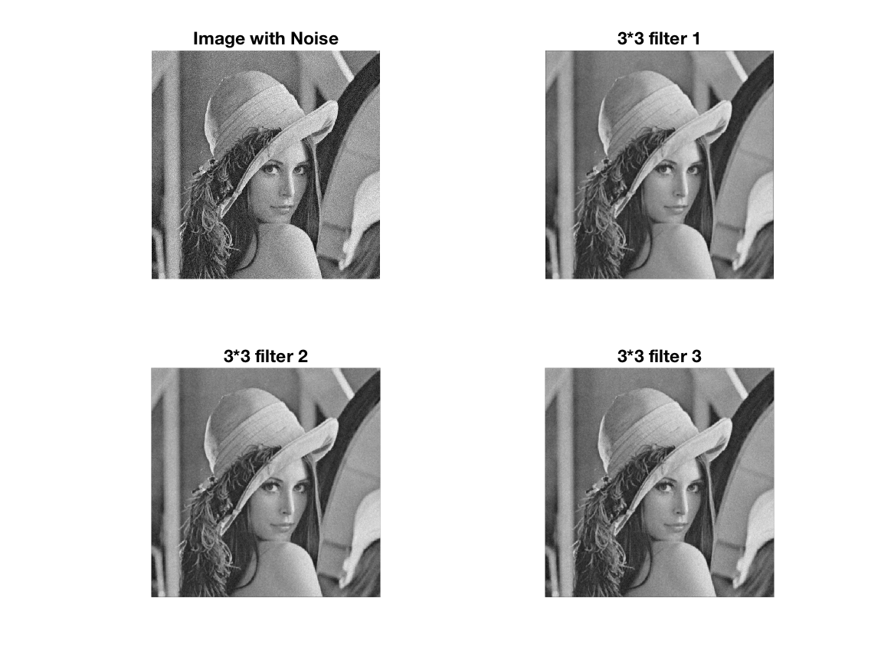
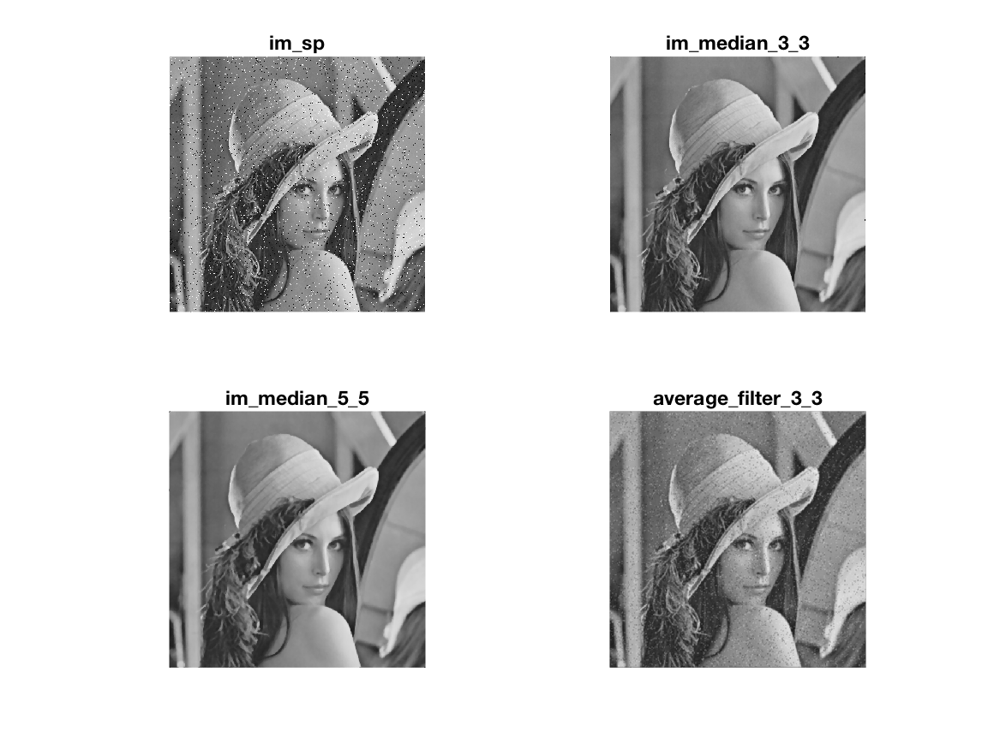

### 01.Write a function to measure the Peak Signal to Noise Ratio (PSNR) between two gray images in dB. For the peak value use 255. 

#### Solution
Use a nested for loop go through every pixel point in those two images and compute out MSE and then implement the PSNR formula.

Matlab code like below and save as mypsnr.m.

```matlab
function y = mypsnr(im,im2)
the_mse = mymse(im,im2);
y = 10 * log10(255^2/the_mse);
end

function y = mymse(im,im2)
[im_w,im_h] = size(im);
err = 0.0;
for im_y = 1:im_h
    for im_x = 1:im_w
       err = err + (double(im(im_x,im_y))-double(im2(im_x,im_y)))^2;
    end
end
y = err/(im_w*im_h);
end

```
### 02.Evaluate the PSNR of provided images with the reference image im and complete the table: 

| Image | lenna512_AWGN | lenna512_SandP | lenna512\_low\_dynamic\_range 
|-------|---------------|----------------|----------------------|
| **PSNR**  |    28.1069    |     19.4781    |        23.9912       |

### Check the histogram of all the previous images, compare them with the histogram of the reference image, comments and briefly explain your finding. 

#### Solution
With mypsnr() function defined in task1 and compute PSNR between im and im_wn, im_sp, im_low respectively. And then plot out 4 histograms in one figure for easier comparision.
Run matlab code attached below:

```matlab
im = imread('lenna512.bmp');
im_wn = imread('lenna512_AWGN.bmp');
im_sp = imread('lenna512_SandP.bmp');
im_low = imread('lenna512_low_dynamic_range.bmp');


mypsnr(im,im_wn)
mypsnr(im,im_sp)
mypsnr(im,im_low)

t2_hist_comparison = figure('Name','Histogram Comparison')
subplot(2,2,1)
plot(imhist(im)),title('Reference')

subplot(2,2,2)
plot(imhist(im_wn)),title('AWGN')

subplot(2,2,3)
plot(imhist(im_sp)),title('SandP')

subplot(2,2,4)
plot(imhist(im_low)),title('Low Dynamic Range')

print('t2_hist_comparison','-dpng')

```
The result shows like below(also showed in the image-PSNR table): 

```matlab
>> t2

ans =

   28.1069


ans =

   19.4781


ans =

   23.9912
```
**Intepretion**: 

The AWGN image has the greatest PSNR value while the SandP image has the smallest value, which tells that AWGN is closest to reference image and SandP has the most noise.


And figure like below is expected:

**Figure 2.1:** Histogram Comparison



**Intepretion**:

*  **AWGN image** has same color range but a quite different color dictribution as the reference image, which matches the manipulation, color value next to each other are averaged. 
* **SandP image** has a very similar histogram as the reference image expect for two extral high peaks located at 0 and 255, which is result from all extral noise points, because all noise points are either black or white dots.
* **Low Dynamix Range image** has a much smaller color range, likely [60:200] comparing to [20:230] range other images contain, which matches well with the low contrast featue this image have.

### 03.Write a function to generate a piece-wise linear mapping transform to enhance the contrast of im\_low\_dynamic\_range.
### Verify the effectiveness of several mapping transform in the following terms: (1) subjectively, and objectively by evaluating the  (2) PSNR with respect to the reference image. Include also in your report the best intensity mapping function you obtained. 

#### Solution
With a nested for loop go through every pixel in image, apply the piecewise function to every pixel value.

Write matlab code and save as **streching\_enhancing.m**

```matlab
function y = streching_enhancing(im,x1,x2,y1,y2)
[im_w,im_h] = size(im);
out_im = zeros(im_w,im_h);
for y = 1:im_h
    for x = 1:im_w
        p = double(im(x,y));
        if p < x1
            out_im(x,y) =  p * y1/x1;
        elseif p < x2
            out_im(x,y) = (p - x1)*(y2-y1)/(x2 - x1) + y1;
        else
            out_im(x,y) = (p - x2)*(255-y2)/(255-x2) + y2;
        end
    end
end
y = uint8(out_im);
end
```

Assume the selected range will cover the middle point, define function sePSNR() take selected range and strech image to full range[0:255], compute PSNR respectively with following matlab code:

```matlab
im = imread('lenna512.bmp');
im_low = imread('lenna512_low_dynamic_range.bmp');

sePSNR = zeros(128,128);

for a = [1:1:128]
    for b = [128:1:255]
%         t = [a:1:b]
        im_se = streching_enhancing(im_low,a,b,0,255);
        sePSNR(a,b-127) = mypsnr(im_se,im);
    end
end
```
and find the maxim PSNR will be 

```
ans =

   50.4302
```

with the matching selected range **[43:211]**, run matlab code attached below, which intends to strech the original color range from [43:211] to full range [0:255] and show the outcome image comparision also with histogram comparision.

```matlab
im = imread('lenna512.bmp');
im_low = imread('lenna512_low_dynamic_range.bmp');
im_se = streching_enhancing(im_low,43,211,0,255);

mypsnr(im_se,im)

im_comparision = figure('Name','Image Comparision');
imshowpair(im_low,im_se,'montage'),
title('Low Dynamic Range Image vs. Streching Enhanced Image (with Max PSNR)')
print('im_comparision', '-dpng')

t3_hist_comparision = figure('Name','Histogram Comparision');
subplot(1,3,1);
plot(imhist(im_low)),title('Low Dynamic Range Image');
subplot(1,3,2);
plot(imhist(im_se)),title('Stench Enhanced Image');
subplot(1,3,3);
plot(imhist(im)),title('Original Image');
print('t3_hist_comparision','-dpng')

```
Result, the PSNR will of course be:

```
>> t3

ans =

   50.4302
   
```
and figures like below are expected:

**Figure 03.1**: Image Comparision

 
 

**Figure 03.2**: Histogram Comparision

 
 
 
 **Intepretion**:
 
* **Subjective observation from output image comparision**: As can be seen, the imae contrast has been improved, brighr and dark zone are enhanced and are now more obvious.
* **Objective evaluation from histogram comparision**: Strech Enhanced Image has a much wider color range than Low Dynamic Range image which is exactly why the strech enhanced image has higher contrast. 
[43,211]

**Try some other ranges** like [20,230],[30,220],[50:200],[60,190] to strench enhance the image with matlab code attached below:

```matlab
im = imread('lenna512.bmp');
im_low = imread('lenna512_low_dynamic_range.bmp');
im_se = streching_enhancing(im_low,43,211,0,255);
im_se_20_230 = streching_enhancing(im_low,20,230,0,255);
im_se_30_220 = streching_enhancing(im_low,30,220,0,255);
im_se_50_200 = streching_enhancing(im_low,50,200,0,255);
im_se_60_190 = streching_enhancing(im_low,60,190,0,255);


hist_different_se_range = figure('Name','Different Strech Enhancing Range Comparision');
subplot(3,2,1);
plot(imhist(im_se_20_230)),title('Range[20,230]');
subplot(3,2,2);
plot(imhist(im_se_30_220)),title('Range[30,220]');
subplot(3,2,3);
plot(imhist(im_se)),title('Range[43,211]');
subplot(3,2,4);
plot(imhist(im)),title('Reference');
subplot(3,2,5);
plot(imhist(im_se_50_200)),title('Range[50:200]');
subplot(3,2,6);
plot(imhist(im_se_60_190)),title('Range[60,190]');
print('hist_different_se_range','-dpng')

im_different_se_range = figure('Name','Different Strech Enhancing Range Comparision');
subplot(3,2,1),imshow(im_se_20_230),,title('Range[20,230]');
subplot(3,2,2),imshow(im_se_30_220),title('Range[30,220]');
subplot(3,2,3),imshow(im_se),title('Range[43,211]');
subplot(3,2,4),imshow(im),title('Reference');
subplot(3,2,5),imshow(im_se_50_200),title('Range[50:200]');
subplot(3,2,6),imshow(im_se_60_190),title('Range[60,190]');
print('im_different_se_range','-dpng')
```
The histogram and image comparision will be like figures attached below:

**Figure 03.3**: Image Comparision

 

**Figure 03.4**: Histogram Comparision

 

**Intepretion**:

* **Subjective observation from output image comparision**:  If range comes closer to optimized range, the outcome image will be closer to reference, while too wide range will outcome an image with lower contrast (similar to Low Dynamic Range Image) and too narrow range will outcome an image with over exposure .
* **Objective evaluation from histogram comparision**:  A too wide range (comparing to optimized range) the none zero color range will not be as wide, while a too narrow range could eventually gets a wide enough color range but value close to 0 and 255 will be much higher and presents a too strong contrast image with over dark and bright zones. 
 
 
###04. Use the command histeq which enhances the contrast of the images by transforming the values in an intensity image. 
### Compare the current result with the one obtained in Task 3. Comment and briefly explain your finding. 
 
 ```matlab
im = imread('lenna512.bmp');
im_low = imread('lenna512_low_dynamic_range.bmp');
im_se = streching_enhancing(im_low,43,211,0,255);
im_eq = histeq(im_low);

mypsnr(im_eq,im)

t4_hist_comparision = figure('Name','Histogram Comparision');
subplot(2,2,1);
plot(imhist(im_low)),title('Low Dynamic Range Image');
subplot(2,2,2);
plot(imhist(im)),title('Original Image');
subplot(2,2,3);
plot(imhist(im_eq)),title('Equalization Enhanced Image');
subplot(2,2,4);
plot(imhist(im_se)),title('Strech Enhanced Image');

print('t4_hist_comparision','-dpng')

histeq_im_comparision = figure('Name','Histogram Equilization Image Comparision');
subplot(2,2,1),imshow(im_low),title('Low Dynamic Range Image');
subplot(2,2,2),imshow(im),title('Original Image');
subplot(2,2,3),imshow(im_eq),title('Equalization Enhanced Image');
subplot(2,2,4),imshow(im),title('Strech Enhanced Image');

print('histeq_im_comparision','-dpng')

 ```
 Run matlab code provided above, will get result:

```
>> t4

ans =

   19.0767
```
 and figures like below are expected:

**Figure 04.1**: Histogram Comparision

 
 
 **Figure 04.2**: Histogram Equilization Image Comparision
 s
 
 **Intepretion**:
While stretch enhanced image are quite well restored, the outcome from histeq() is not as statisfying. It generally overly enhance the contrast and produces a too strong bright and dark zones. When shows on histogram, the stretch enhanced image can remain a similar trend but the histogram equalized image remains a quite different distribution. 
 

### 05.Design a linear spatial domain filter to attempt to improve the PSNR of the image lenna512_AWGN.bmp by as much as you can, it is suggested that you try 3X3 and 5X5 kernels. 

Run matlab code as attached below to test on 3*3 filter:

```matlab 
im = imread('lenna512.bmp');
im_wn = imread('lenna512_AWGN.bmp');

% 3*3 filter
filter_3_1 = [1/17,3/17,1/17;
              3/17,1/17,3/17;
              1/17,3/17,1/17];

filter_3_2 = [1/25,5/25,1/25;
              5/25,1/25,5/25;
              1/25,5/25,1/25];

filter_3_3 = [1/33,7/33,1/33;
              7/33,1/33,7/33;
              1/33,7/33,1/33];

          
im_filter_3_1 = imfilter(im_wn,filter_3_1);
im_filter_3_2 = imfilter(im_wn,filter_3_2);
im_filter_3_3 = imfilter(im_wn,filter_3_3);

mypsnr(im,im_filter_3_1)
mypsnr(im,im_filter_3_2)
mypsnr(im,im_filter_3_3)

t5_1_im_comparision = figure('Name','Image Comparision');
subplot(2,2,1),imshow(im_wn),title('Image with Noise');
subplot(2,2,2),imshow(im_filter_3_1),title('3*3 filter 1');
subplot(2,2,3),imshow(im_filter_3_2),title('3*3 filter 2');
subplot(2,2,4),imshow(im_filter_3_3),title('3*3 filter 3');
print('t5_1_im_comparision','-dpng')

```

Result will be like  below, when edge values get bigger PSNR get smaller.This can also be told from these outcome images like plotted in figure 5.1, the edge values get smaller, the noise is better cancelled out. It could be assumsed that a smaller edge value can improve PSNR.

```
>> t5_1

ans =

   31.0564


ans =

   30.9611


ans =

   30.8822

```

**Figure 05.1**: Image Comparision

 
 

To furthermore testify if it's because the difference between edge and corner values determins the outcome, matlab code as attached below is written:

```matlab
im = imread('lenna512.bmp');
im_wn = imread('lenna512_AWGN.bmp');


filter_3_4 = [3/33,5/33,3/33;
              5/33,1/33,5/33;
              3/33,5/33,3/33];
          
filter_3_5 = [3/41,7/41,3/41;
              7/41,1/41,7/41;
              3/41,7/41,3/41];
          
filter_3_6 = [5/49,7/49,5/49;
              7/49,1/49,7/49;
              5/49,7/49,5/49];
          
          
im_filter_3_4 = imfilter(im_wn,filter_3_4);
im_filter_3_5 = imfilter(im_wn,filter_3_5);
im_filter_3_6 = imfilter(im_wn,filter_3_6);


mypsnr(im,im_filter_3_4)
mypsnr(im,im_filter_3_5)
mypsnr(im,im_filter_3_6)

t5_2_im_comparision = figure('Name','Image Comparision');
subplot(2,2,1),imshow(im_wn),title('Image with Noise');
subplot(2,2,2),imshow(im_filter_3_4),title('3*3 filter 4');
subplot(2,2,3),imshow(im_filter_3_5),title('3*3 filter 5');
subplot(2,2,4),imshow(im_filter_3_6),title('3*3 filter 6');
print('t5_2_im_comparision','-dpng')

```
 
After run the code, result will be like  below, it shows it's not the diffetenced between edge and conor matters. And  a smaller edge value can improve PSNR.

```
>> t5_2

ans =

   30.8966


ans =

   30.6967


ans =

   30.4063
```

**Figure 05.2**: Image Comparision

 
 
Thus, the best 3*3 linear filter mained among all tested filters is:

```matlab
[1/17,3/17,1/17;
  3/17,1/17,3/17;
  1/17,3/17,1/17];
``` 
Run matlab code  attached below to test 5*5 filter:

```matlab
im = imread('lenna512.bmp');
im_wn = imread('lenna512_AWGN.bmp');

% 5*5 filter
filter_5_1 = [1/41,1/41,1/41,1/41,1/41;
              1/41,3/41,3/41,3/41,1/41;
              1/41,3/41,1/41,3/41,1/41;
              1/41,3/41,3/41,3/41,1/41;
              1/41,1/41,1/41,1/41,1/41];
              
filter_5_2 = [1/57,1/57,1/57,1/57,1/57;
              1/57,5/57,5/57,5/57,1/57;
              1/57,5/57,1/57,5/57,1/57;
              1/57,5/57,5/57,5/57,1/57;
              1/57,1/57,1/57,1/57,1/57];
          
filter_5_3 = [1/73,1/73,1/73,1/73,1/73;
              1/73,7/73,7/73,7/73,1/73;
              1/73,7/73,1/73,7/73,1/73;
              1/73,7/73,7/73,7/73,1/73;
              1/73,1/73,1/73,1/73,1/73];
          
im_filter_5_1 = imfilter(im_wn,filter_5_1);
im_filter_5_2 = imfilter(im_wn,filter_5_2);
im_filter_5_3 = imfilter(im_wn,filter_5_3);

mypsnr(im,im_filter_5_1)
mypsnr(im,im_filter_5_2)
mypsnr(im,im_filter_5_3)

t5_3_im_comparision = figure('Name','Image Comparision');
subplot(2,2,1),imshow(im_wn),title('Image with Noise');
subplot(2,2,2),imshow(im_filter_5_1),title('5*5 filter 1');
subplot(2,2,3),imshow(im_filter_5_2),title('5*5 filter 2');
subplot(2,2,4),imshow(im_filter_5_3),title('5*5 filter 3');
print('t5_3_im_comparision','-dpng')

```

Resulte will be like below, compare them to 3*3 filters, all 5\*5 filters produce smaller psnr values than all previous 3\*3 filter and noise is not as well cancelled, which indicates 3\*3 filter works better here.

```
>> t5_3

ans =

   29.0825


ans =

   29.4340


ans =

   29.6013
```

**Figure 05.3**: Image Comparision

 

### 06.Display and evaluate the PSNR of the obtained images. For each window size, comment on how effectively the noise is reduced while sharp edges and features in the image are preserved. Use the average filter 3X3 to filter the image im_SP. Compute the PSNR and display the filtered image. As you experimented with the mean and median algorithms what different “performance” did you notice? Was the average or median filter better, and why? 
Run matlab code as attached below:

```matlab
im = imread('lenna512.bmp');
im_sp = imread('lenna512_SandP.bmp');

im_median_3_3 = medfilt2(im_sp,[3,3]);
im_median_5_5 = medfilt2(im_sp,[5,5]);

average_filter_3_3 = [1/9,1/9,1/9;
                      1/9,1/9,1/9;
                      1/9,1/9,1/9];
im_average = imfilter(im_sp,average_filter_3_3);

mypsnr(im_median_3_3,im)
mypsnr(im_median_5_5,im)
mypsnr(average_filter_3_3,im)


t6_im_comparision = figure('Name','Image Comparision');
subplot(2,2,1),imshow(im\_sp),title('im_sp');
subplot(2,2,2),imshow(im_median_3_3),title('im\_median\_3\_3');
subplot(2,2,3),imshow(im_median_5_5),title('im\_median\_5\_5');
subplot(2,2,4),imshow(im_average),title('average\_filter\_3\_3');
print('t6_im_comparision','-dpng')
```
Resulte will be like below, 

```
>> t6

ans =

   34.7099

ans =

   31.0351

ans =

   27.0544

```

**Figure 06.1**: Histogram Comparision

 
 
  **Intepretion**:
As can tell from figure 06.1, it's quite obvious that median method performs much better on noise cancelling,  while median algorthm successfully cancelled out all noise and restored the image, result image from mean algorthm  maintains reletively high rate of noises. And with median algorthm, a 3\*3 filter performs better than a 5\*5 filter. Not only does it has better PSNR, but also 3\*3 filter generates a sharper image while outcome from 5*5 filter is blurrier. 