#### **MultiMedia Telecommunication, M.S. Program @ [XJTLU](http://www.xjtlu.edu.cn/en/)**

# Image and Video Processing | EEE412

#### **Lab 03: Image Transforms**

**Objectives:**
* To master the use of different image transforms techniques 
* To master the use of Frequency Domain for image filtering  


==**Professor:** Qiufeng Wang 
**Student:** Le Zhou, 1715218==

<br/>
<br/>
<br/>
<br/>
<br/>
<br/>
<br/>
<br/>
<br/>
<br/>

**Aven Le Zhou**
M.S. MMT@XJTLU
**&middot;** +86 13917613964 **&middot;** www.aven.cc **&middot;** Le.Zhou17@xjtlu.edu.cn

## Task01:
**PSNR Table:**

| PSNR | 32/256  | 64/256 | 96/256 | 128/256 | 160/256 | 192/256 | 224/256 |
|------|---------|--------|--------|---------|---------|---------|---------|
| DFT  |    15.6165 |15.6581   |15.6702   |   15.6756   |15.6781   |   15.6902   |   15.7263 |
| DCF  |   63.9348|73.4854|79.7143|84.9672|90.2204|96.4510|106.0110|

### Solution: 
First use matlab function **fft()** and **dct()** to compute the dft and dct value respectively and plot them out in one figure, as in line 1 ~ 10; Then choose percentage -- **32/256**(as filter **x <= 32** in line 12 and line 16) and apply to dft and dct result respectively, then use **ifft()** and **idcf()** to convert the filtered data from frequency zone back to spational domain, and finally compute the pnsr and plot out original and reconstructed data in one figure for easier comparision.

**Matlab code:**

```matlab
x = 1:256;
fft_x = fft(x);
dct_x = dct(x);
% show x and fft &dct of x
t1_original = figure('Name','Original');
t1_original.OuterPosition = [100 100 1080 420];
subplot(1,3,1),plot(x,'m'),axis([-5,255,-5,255]),title("x");
subplot(1,3,2),plot(fft_x,'r'),grid on, title("DFT");
subplot(1,3,3),plot(dct_x,'g'),grid on, title("DCT");
print('images/t1_original','-dpng');
% reconstruct x with fft fiter32
fft_x_32 = fft_x.*(x <= 32);
x_fft32 = abs(ifft(fft_x_32));
psnr_fft32 = psnr(x_fft32,x,255)
% reconstruct x with dct fiter32
dct_x_32 = dct_x.*(x <= 32);
x_dct32 = abs(idct(dct_x_32));
psnr_dct32 = psnr(x_dct32,x,255)
% show original and reconstructed data with fft and dct filter in one figure
t1_filter32 = figure('Name','FFT vs DCF Reconstruct with filter 32');
t1_filter32.OuterPosition = [100 100 1080 420];
subplot(1,3,1),plot(x,'m'),grid on, title("Original Data");
subplot(1,3,2),plot(x_fft32,'r'),grid on, title("FFT reconstruct with filter 32");
subplot(1,3,3),plot(x_dct32,'g'),grid on,title("DCF reconstruct with filter 32");
print('images/t1_filter32','-dpng');
```

**==Implementation on original dft and dct:==** With the matalb code attached here, figure like below is expected. As figure1.01 shows, the maganitude of dft of the data has a wide range: -1 * 10^4 ~ 1 *1 0^4, for main frequencies, approximately in range 0 ~ 3.5 * 10^4, maganitude  range is 0 ~ 1 * 10 ^4 and in a linear ratio. Meanwhile, maganitude of the dct of the data has a reletively small range, roughly -1200~2000, and for main frequencies, take 5~ 255 as example, the maganitude range would be approximately -50 ~ 0. 

**Figure1.01** Original Data with DFT and DCT
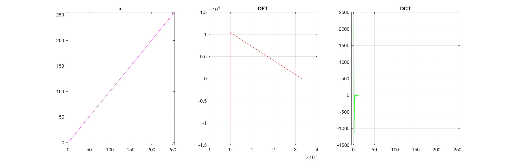

With the **filter x < 32** to force part of data into zeros and reconstruct the line, a comparision of original and reconstructed data in one figure would be like:

**Figure1.02** Original Data with DFT and DCT

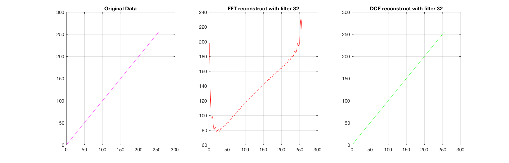

And the psnr result computed by matlab would be:

```matlab
psnr_fft32 =

   13.6865

psnr_dct32 =

   63.0745
```
**==Comments on DCT and DFT methods:==**The comparision of DFT and DCT results indicates that, compare to DFT methos, DCF method can reconstruct the original data well and with much less loss in the case. The psnr value also differs, DFT has a much lower value, which matches previous conclusion.

For all other filters, write a function, attached below, and save as reconstructWithFilter.m to compute psnr pairs fill into the PSNR table and generate the comparision graph. 

```matlab
function y = reconstructWithFilter(filter)
x = 1:256;
fft_x = fft(x);
dct_x = dct(x);
% reconstruct x with fft fiter32
x_fft = abs(ifft(fft_x.*(x <= filter)));
psnr_fft = psnr(x_fft,x,255);
% reconstruct x with dct fiter32
x_dct = abs(idct(dct_x.*(x <= filter)));
psnr_dct = psnr(x_dct,x,255);
% show original and reconstructed data with fft and dct filter in one figure
fig = figure('Name','FFT vs DCF Reconstruct with filter');
fig.OuterPosition = [100 100 1080 420];
subplot(1,3,1),plot(x,'m'),title("Original Data");
subplot(1,3,2),plot(x_fft,'r'),title("FFT reconstruct with filter " + filter);
subplot(1,3,3),plot(x_dct,'g'),title("DCF reconstruct with filter " + filter);
print('images/reconstructWithFilter', '-dpng');
y = [psnr_fft,psnr_dct];
end
```
**Figures to show all filters:**| 64/256 | 96/256 | 128/256 | 160/256 | 192/256 | 224/256 |
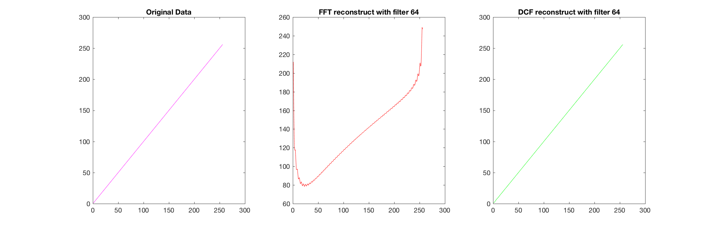

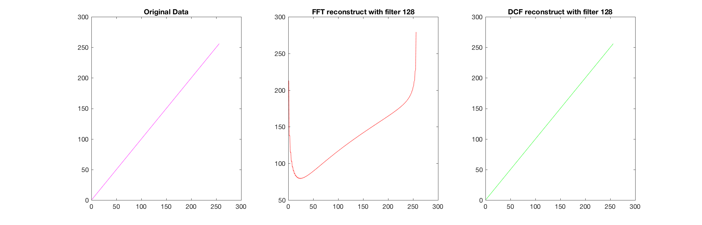
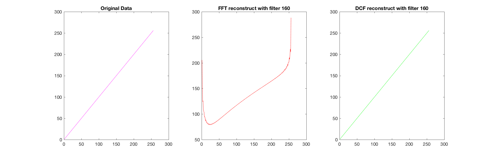
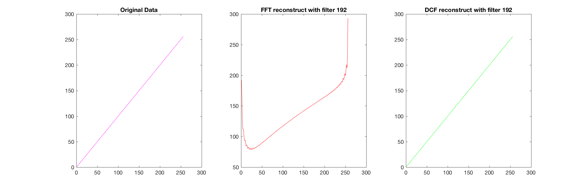


**==Comments on different filters:==**The DCT method work very well with all provided filters and can reconstruct the original data with on loss all the time, and the psnr also increases when the filter changes, the value starts from 63.9348 with filter 32/256 and increases to 106.0110 when the filter is 224/256.  Meanwhile, the DFT method can not reconstruct a statisy enough result, the psnr increases but very little, even with the best effect filter --  224/256(for DCF method), the psnr is still quite low as 15.7263. The reconstructed data doesn't seem  to gett closer to original data. 

</br>
</br>

## Task02:
### Solution:
Run code attached below for **==sub task a and b==**,  and show the images with matlab function **imagesc()** for more obvious effects.

```matlab
width = 256;
N = width/16;
n = [1:width]-1;
x = 1 + cos(2*pi*n/N);
im = ones(width,1)*x;

t2_a = figure('Name','Original IM');
imagesc(im);
print('images/t2_a','-dpng');

t2_b1 = figure('Name','log of magnitude of 2D-DFT');
imagesc(abs(log2(fft2(im))));
print('images/t2_b1','-dpng');

t2_b2 = figure('Name','log of magnitude of fftshift 2D-DFT');
imagesc(abs(log2(fftshift(fft2(im)))));
print('images/t2_b2','-dpng');
```
Figure response to subtask a will be like this:

**Figure 2.a:** Original IM

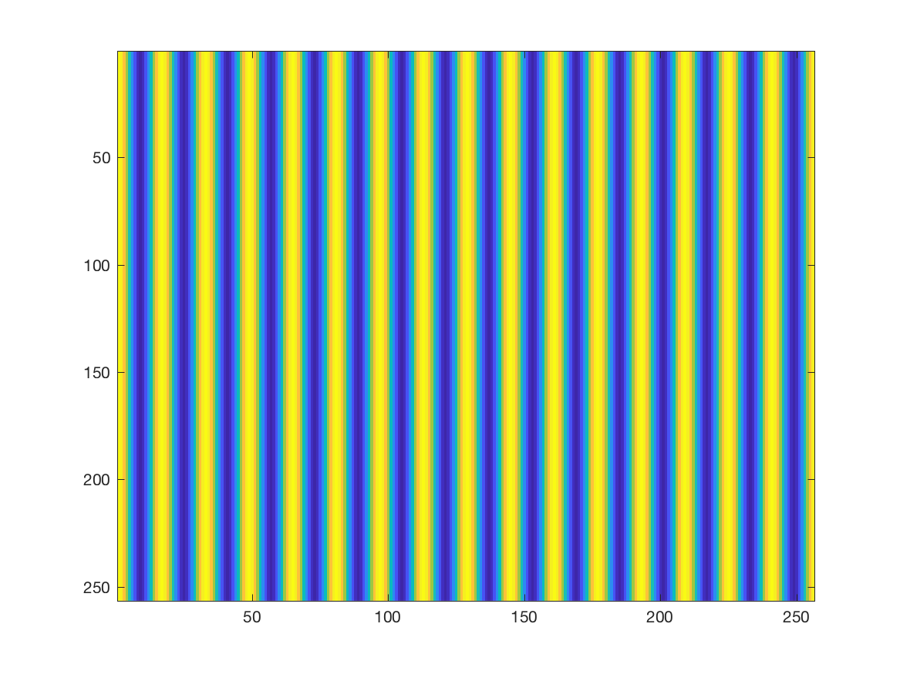

==**Observation for subtask a:**==The image signal remain the same on Y axis and repeat with a period on X axis, so the answer is yes, it is a periodic signal/ image.
Figures response to subtask b are attached below, the DFT image uses only fft2() on left, and the one applied fftshift() on right:

**Figure 2.b1:** log of magnitude of 2D-DFT & **Figure 2.b2:** log of magnitude of fftshift 2D-DFT

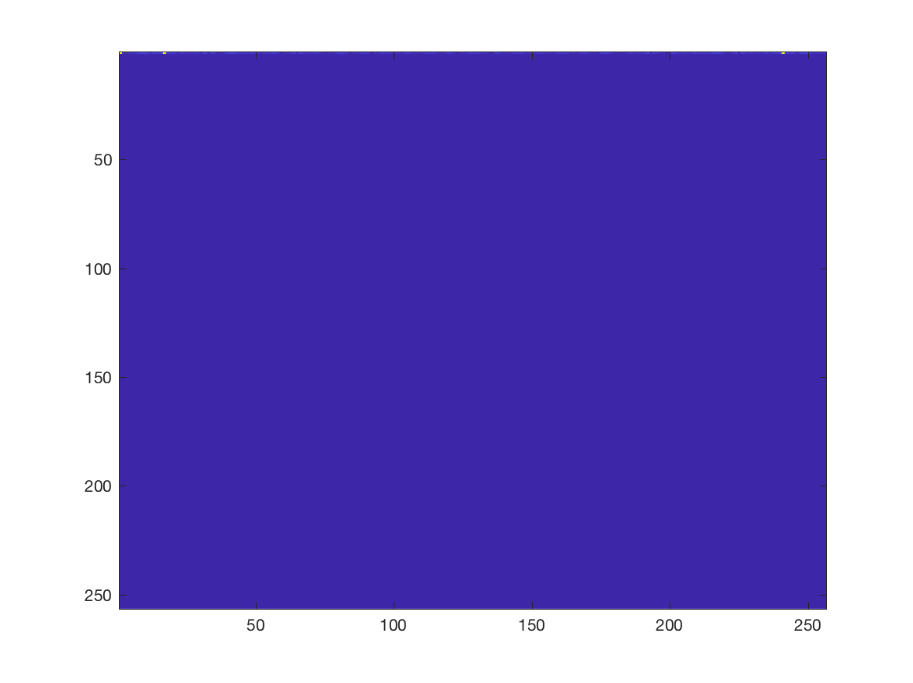

**==Observation for subtask b:==**The original image has a quite simple DFT, for the DFT image without fftshift(), there are three bright spots located on the first line of the image, the origin on top left as average gray level value, and the other one close top left connr and one close the top right conner. as main frequencies. With fftshift() function, it will simply move the dots to the center of the image, and the shifted(fftshift()) DFT has three bright spots symmetrically located in the center of the DFT image, origin moves to the center.
Change N to width/8, and run matlab code attached below for **==subtask c==**, 

```matlab
width = 256;
N = width/8;
n = [1:width]-1;
x = 1 + cos(2*pi*n/N);
im = ones(width,1)*x;

t2_c1 = figure('Name','Original IM');
imagesc(im);
print('images/t2_c1','-dpng');

t2_c2 = figure('Name','log of magnitude of 2D-DFT');
imagesc(abs(log2(fft2(im))));
print('images/t2_c2','-dpng');

t2_c3 = figure('Name','log of magnitude of fftshift 2D-DFT');
imagesc(abs(log2(fftshift(fft2(im)))));
print('images/t2_c3','-dpng');
```
**Figure 2.c1:** IM with Changed N

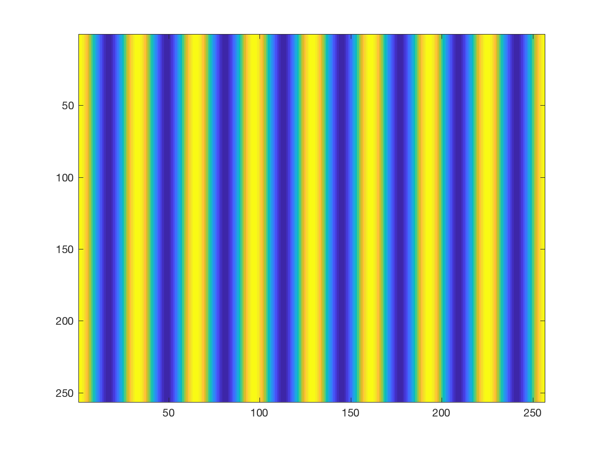

**Figure 2.c2:** log of magnitude of 2D-DFT with Changed N & **Figure 2.c3:** log of magnitude of fftshift 2D-DFT


**Compare results of ==subtask c== with original one and implementation:** The DFT image from the changed N is still quite simple and with 3 bright dots in the image, from the image before fftshift(), the difference are hard to tell, but with the fftshifted image, even though these three dots remains symmetrically centered on the image, it is quite clear that the peak frequencies get closer to each other, which can be explained by the fact that N as period of the cos function increases and results in DFT image the peak frequencies gets closer.

Change x = 1+cos(2 * pi * n/N)+ cos(4 * pi * n/N) with matlab code attached below for **==subtask d==**,

```matlab
width = 256;
N = width/16;
n = [1:width]-1;
x = 1 + cos(2*pi*n/N) + cos(4*pi*n/N);
im = ones(width,1)*x;
t2_d1 = figure('Name','Original IM');
imagesc(im);
print('images/t2_d1','-dpng');
t2_d2 = figure('Name','log of magnitude of 2D-DFT');
imagesc(abs(log2(fft2(im))));
print('images/t2_d2','-dpng');
t2_d3 = figure('Name','log of magnitude of fftshift 2D-DFT');
imagesc(abs(log2(fftshift(fft2(im)))));
print('images/t2_d3','-dpng');
```
**Figure 2.d1:** Original IM

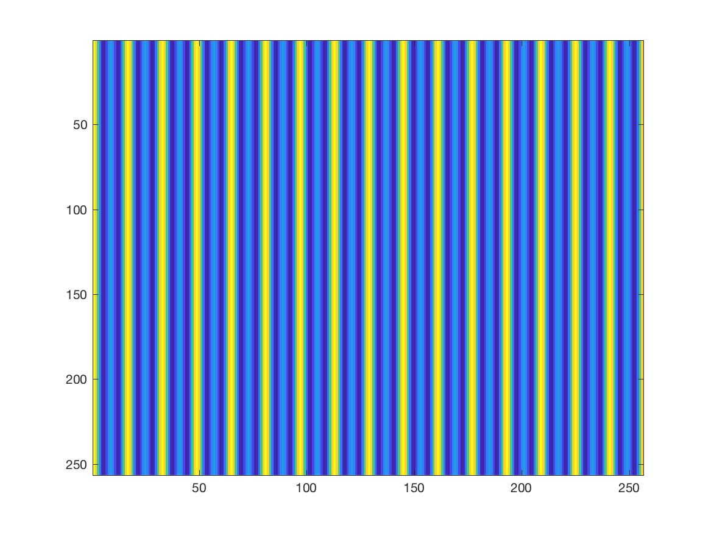

**Figure 2.d2:** log of magnitude of 2D-DFT & **Figure 2.d3:** log of magnitude of fftshift 2D-DFT


**Compare results of ==subtask d== with original one and implementation:** As a not pure cos signal, the DFT image has 5 bright dots, origin remians the same but as sum of two cos function(happen to be signals in b and c), so it has 2*2 = 4 peak frequencies(5 in total) and simply a overlay of previous 2 DFT images.

## Task03:
**Solution:**
Solution and workflow for this task is organised as the following figure:
**Figure03.03** Workflow diagram:

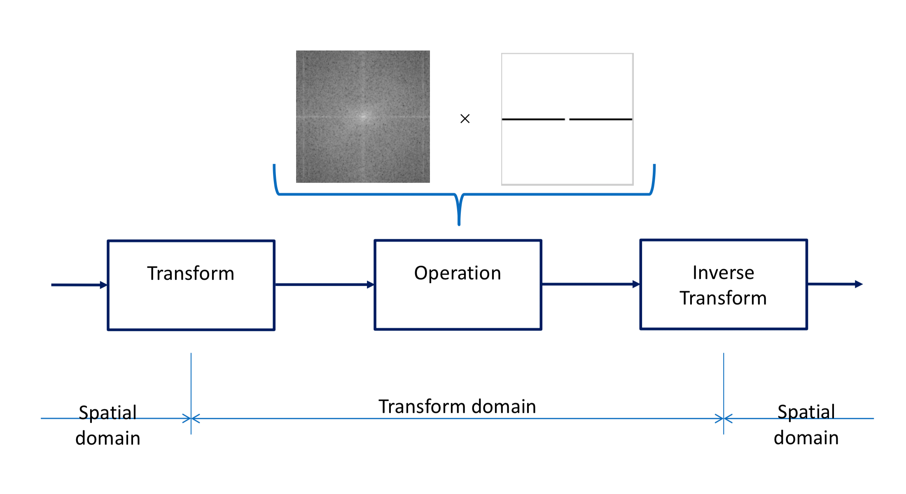

Since the operation will be carried out in transform domain, first, the image is transformed to frequency domain, and there a filter will be applied. When operarion is done, the result will go through an inverse transform process and be converted to spational domian. With the code below will get the fence removed from the original image: 

```matlab
im_origin = imread('images/fence.jpg');
im = rgb2gray(im_origin);                % convert to gray scale   
im_fft = fft2(im);                       %2D DFT
im_fftshift = fftshift(im_fft);          %shift DFT result
[rows,cols] = size(im);
filter = ones(rows,cols);                %construct filter matrix
rows_center = floor(rows/2);
cols_center = floor(cols/2);
h = 40; w = 10;
filter(rows_center-h/2:rows_center+h/2,1:cols_center-w/2) = 0;
filter(rows_center-h/2:rows_center+h/2,cols_center+w/2:cols) = 0;
%apply filter
im_fftshift_filtered = im_fftshift .*filter; 
%inverse fftshift
im_inverse_fftshift = ifftshift(im_fftshift_filtered); 
%inverse fft2
im_inverse_fft = uint8(abs(ifft2(im_inverse_fftshift)));
imwrite(im_inverse_fft,'images/remove_fence.png');
```
The out come will be like:

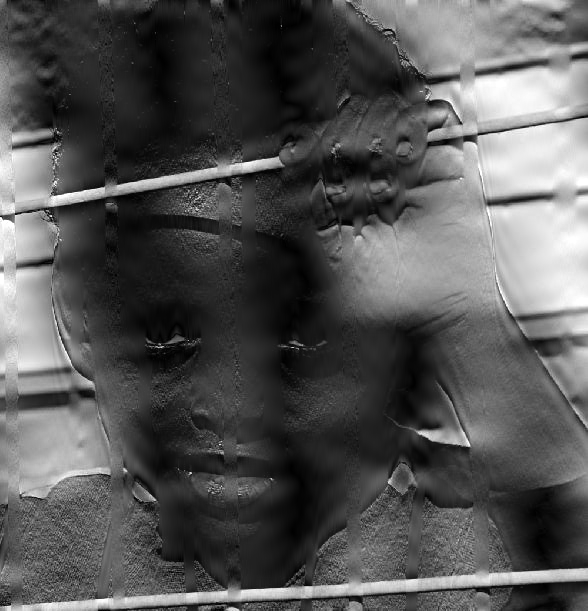

What the code does here is first transform the image into frequency domain, as figures shows below, for better visual effect, the third plot take the **log of maganitude** and also all images are showed with **imagesc()** function:
**Figure03.03** From Spational Domain to Frequency Domain:

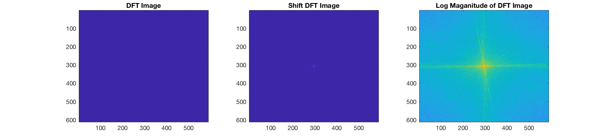

and then construct a filter, shows with **imagesc()** function graph on leftm and (for better visual effect, log of maganitude image is applied filter and be showed here) filter is applied in transformed domain.

**Figure03.04** Filter & **Figure03.04** DCT image with filter.

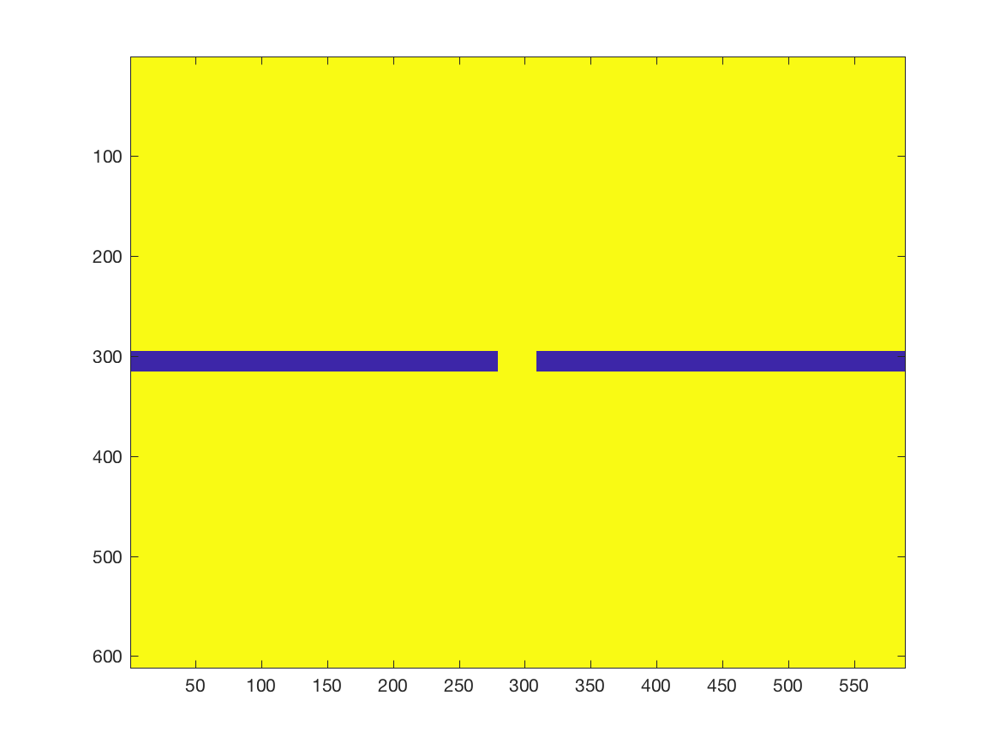

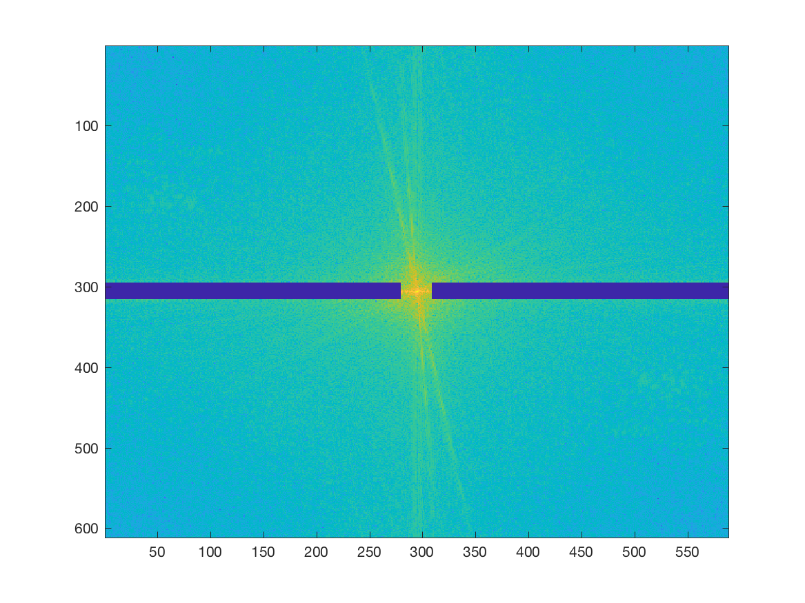

Then apply the filter to the shift DFT image(**NOT** the log of maganitude shift image) and inverse the fftshift and dft process:

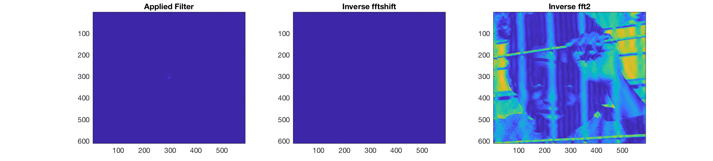

**Comments:** Considering the difficulty of the task itself, the result is acceptable,  not quite satisfying yet fine. With a larger **h (in code line 9)** and smaller **w (in code line 9)** value, the vertical fence can be better removed and with a smoother gradient at the removed fences location but meanwhile the image will be more blurry.  A balance has to be made here to acheive the best result.

</br>
</br>
</br>
</br>
</br>
</br>
</br>
</br>
</br>
</br>
</br>
</br>
</br>
</br>
</br>

## Task04:
PSNR table:

|                     | im420 | im440 |
|---------------------|:-----:|------:|
| zero-padding        |           32.3339 |     36.8108 |
| Imresize,'nearest'  |     28.2869 |     32.7515 |
| Imresize,'lanczos3' |     29.9145 |     34.4147 |
**Solution:**
To construct the zero padding function, first construct a zero matrix with size of target image (in line 3), then place the smaller original image at the center of the zeros matrix(line 9), what worth menthod here is, the original will be placed right at the center and work with no doubts for even number size original image, and meanwhile the original image will be one pixel shift to left for odd number size source image. After finishing adding the padding zeros, the average gray level drops due to the enlarged image size, a scaler which is the ratio of target and original size is applied to the image(line 11), then image is transformed back to spational domain.Matlab implementation is attached here:

```matlab
function y = zeroPadding(im,target_w,target_h)
fft_im = fftshift(fft2(im));
out = zeros(target_h,target_w);

[w,h] = size(im);
t_h = floor(0.5*(target_h - h));
t_w = floor(0.5*(target_w - w));
% apply original DFT to center of this zero
out(t_w + 1 : w + t_w, t_h + 1 : h + t_h) = fft_im;
% scale up
scale = target_w*target_h/(w*h);
out_scale = out*scale;
out_inverse = uint8(abs(ifft2(ifftshift(out_scale))));
y = out_inverse;
end
```
Then use the zero padding technique and matlab imresize() function to resize the provided images, and compute the psnr respectively. 

```matlab
im = imread('images/lenna512.bmp');
im_440 = imread('images/lenna_ds440.bmp');
im_420 = imread('images/lenna_ds420.bmp');

% zero padding
im_zp_440 = zeroPadding(im_440,512,512);
imwrite(im_zp_440,'images/im_zp_440.png');
psnr_zp_440 = psnr(im_zp_440,im,255)

im_zp_420 = zeroPadding(im_420,512,512);
imwrite(im_zp_420,'images/im_zp_420.png');
psnr_zp_420 = psnr(im_zp_420,im,255)

% nearest
im_nearest_440 = imresize(im_440,[512 512],'nearest');
imwrite(im_nearest_440,'images/im_nearest_440.png');
psnr_nearest_440 = psnr(im_nearest_440,im,255)

im_nearest_420 = imresize(im_420,[512 512],'nearest');
imwrite(im_nearest_420,'images/im_nearest_420.png');
psnr_nearest_420 = psnr(im_nearest_420,im,255)

% lanczos3
im_lanczos3_440 = imresize(im_440,[512 512],'lanczos3');
imwrite(im_lanczos3_440,'images/im_lanczos3_440.png');
psnr_lanczos3_440 = psnr(im_lanczos3_440,im,255)

im_lanczos3_420 = imresize(im_420,[512 512],'lanczos3');
imwrite(im_lanczos3_420,'images/im_lanczos3_420.png');
psnr_lanczos3_420 = psnr(im_lanczos3_420,im,255)
```
And psnr values are recorded in the table, resized images with different techniques are attached below:

For original image **'lenna_ds440.bmp'** with size 256 * 512:

**Figure04.01** Reference image  & **Figure04.02** Original Image 440

 

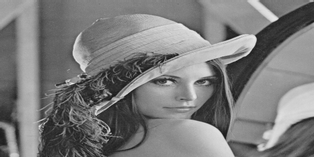

**Figure04.03 to 04.05** Resized Image with zero padding, imresize(kernels nearest, lanczos3) (Left to Right).  

  

For original image **'lenna_ds420.bmp'** with size 256 * 256:
**Figure04.06** Reference image  & **Figure04.07** Original Image 420


**Figure04.08 to 04.10** Resized Image with zero padding, imresize(kernels nearest, lanczos3)(Left to Right).  

  

**Comments on different methods:**From a subjective view, the differences between the result from zero padding technique and matlab function imresize are not very obvious not even noticale. Compare to the reference image, both methods work very well and sucessfully resized the image,  same conclusion can also be obtained from the evaluation of the psnr values.

## Task05
**Solution:**
To generate bases for 4*4 images of 2D DCT,  16 4*4 matrixes are expected and they need to be orthogonal to each other. I didn't figure out a perfect and direct way to compute the answers, but I did discovered some inner link to help compute the results even though I cannot figure out the mathmatical explainnation. Basically, I generated 4 rows and 4 columns of 4*1 matrix, then multiple each row matrix with each column matrix and will result in 16 times caculation with 4*4 matrix, and the answers are orthogonal to each other. The previously mentioned method is implemented by code attached below:

```matlab
function y = DCT_bases( r1,r2,r3,r4,c1,c2,c3,c4 )
out = cell(4);

figure('Name','2D DCT Bases');
out{1,1} =-r1'*c1';  subplot(4,4,1), imagesc(out{1,1});
out{1,2} =-r1'*c2'; subplot(4,4,2), imagesc(out{1,2});
out{1,3} =-r1'*c3'; subplot(4,4,3), imagesc(out{1,3});
out{1,4} =-r1'*c4'; subplot(4,4,4), imagesc(out{1,4});
out{2,1} =-r2'*c1'; subplot(4,4,5), imagesc((out{2,1}));
out{2,2} = r2'*c2'; subplot(4,4,6), imagesc((out{2,2}));
out{2,3} = r2'*c3'; subplot(4,4,7), imagesc((out{2,3}));
out{2,4} = r2'*c4'; subplot(4,4,8), imagesc((out{2,4}));
out{3,1} =-r3'*c1'; subplot(4,4,9), imagesc((out{3,1}));
out{3,2}= r3'*c2'; subplot(4,4,10),imagesc((out{3,2}));
out{3,3}= r3'*c3'; subplot(4,4,11),imagesc((out{3,3}));
out{3,4}= r3'*c4'; subplot(4,4,12),imagesc((out{3,4}));
out{4,1}=-r4'*c1'; subplot(4,4,13),imagesc((out{4,1}));
out{4,2}= r4'*c2'; subplot(4,4,14),imagesc((out{4,2}));
out{4,3}= r4'*c3'; subplot(4,4,15),imagesc((out{4,3}));
out{4,4}= r4'*c4'; subplot(4,4,16),imagesc((out{4,4}));

colormap gray(256); 
print('images/t05_dct_bases','-dpng');

y = out;
end
```
And call the **DCT_bases()** function, pass in 4 rows and 4 columns of matrix, as matlab code below the result would be like figure 05.01:

```matlab
r1=[-1,-1,-1,-1];
r2=[1,0.5,-0.5,-1];
r3=[1,-1,-1,1];
r4=[0.5,-1,1,-0.5];

c1=[-1;-1;-1;-1;];
c2=[1;0.5;-0.5;-1;];
c3=[1;-1;-1;1];
c4=[0.5;-1;1;-0.5];

my_DCT_bases = DCT_bases( r1,r2,r3,r4,c1,c2,c3,c4 );
```
The figure response to **==subtask a==** is:
**Fiure 05.01** 2D DCT Bases.
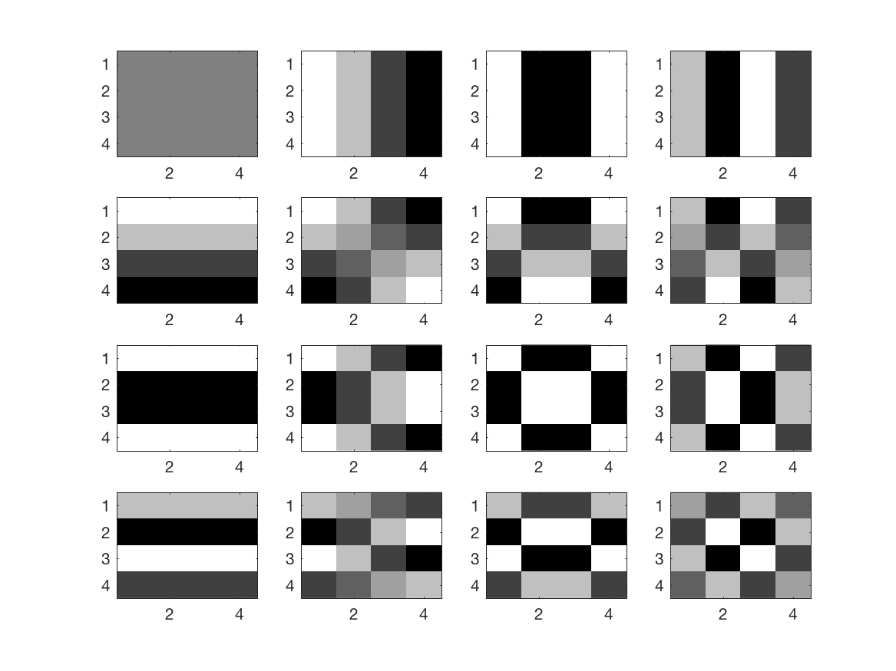

To compute the im_DCT with im and DCT_bases is simply solving out the coeffcients $w_i$ in the formula:
$$
im\_DCT = \sum_{i = 1}^n(w_i * b_i)
$$
For $w_i$, multiply $w_i$ on both side of the formula will reuslt in:
$$
b_i * im\_DCT = \sum_{i = 1}^n(w_i * b_i) * b_i
$$ 

$$
b_i * im\_DCT = w_i  * b_i * b_i
$$ 

which then equivalent to $w_i  = b_i * im\_DCT / (b_i  * b_i ) $. A matlab implementation is attached below, this function needs pass in parameters im and 2D DCT bases, and returns the coefficients matrix:

```matlab
function y = projection_an_image_on_its_DCT_bases(im,DCT_bases)
im_1D = reshape(im,1,16);
coefficients = zeros(4);
for i = 1:4
     for j = 1:4
        the_base_1D = reshape(DCT_bases{i,j},1,16);
        C = dot(im_1D,the_base_1D)/dot(the_base_1D,the_base_1D);
        coefficients(i,j) = C;
     end
end
y = coefficients;
end
```
Then call the **projection\_an\_image\_on\_its\_DCT\_bases()** function, pass in image a, b, c respectively:

```matlab
im_a=[255,0,0,0;
      255,0,0,0;
      255,0,0,0;
      255,0,0,0;];
  
im_b=[0,0,0,0;
      255,255,255,255;
      0,0,0,0;
      0,0,0,0;];
  
im_c=[255,0,0,0;
      0,255,0,0;
      0,0,255,0;
      0,0,0,255;];
  
im_a_DCT = projection_an_image_on_its_DCT_bases(im_a,my_DCT_bases);
im_b_DCT = projection_an_image_on_its_DCT_bases(im_a,my_DCT_bases);
im_c_DCT = projection_an_image_on_its_DCT_bases(im_a,my_DCT_bases);
```
The reuslt response to **==subtask b==** will be like:

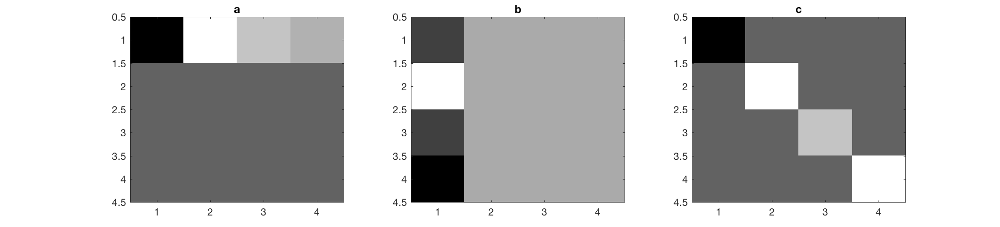

==**Comments:**== Compare the2d DCT images with the original images,  they all seem to be symmetric to each other in pairs. But 4 frequencies maganitude are differ from each other.
And for subtask c, just simply implement formula $ im\_DCT = \sum_{i = 1}^n(w_i * b_i) $ with function: 

```matlab
function y = recover_image( im_DCT,DCT_bases )
out = zeros(4);
for i = 1:4
    for j = 1:4
        out = out + im_DCT(i,j)*DCT_bases{i,j};
    end
end
y = out;
end
```
and compute image a, b and c respectively:

```matlab
im_a_invert = recover_image( im_a_DCT,my_DCT_bases );
im_b_invert = recover_image( im_b_DCT,my_DCT_bases );
im_c_invert = recover_image( im_c_DCT,my_DCT_bases );
```

Obtained results are like: 

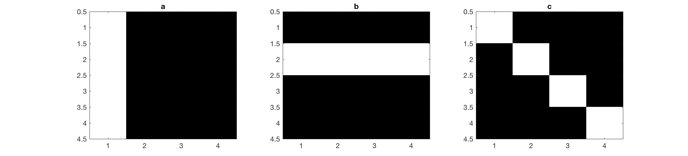
and show in matlab console:

```matlab
>> im_a_invert,im_b_invert,im_c_invert

im_a_invert =

   255     0     0     0
   255     0     0     0
   255     0     0     0
   255     0     0     0


im_b_invert =

     0     0     0     0
   255   255   255   255
     0     0     0     0
     0     0     0     0


im_c_invert =

   255     0     0     0
     0   255     0     0
     0     0   255     0
     0     0     0   255
```
Original images are 100 percentage reconstructed. 