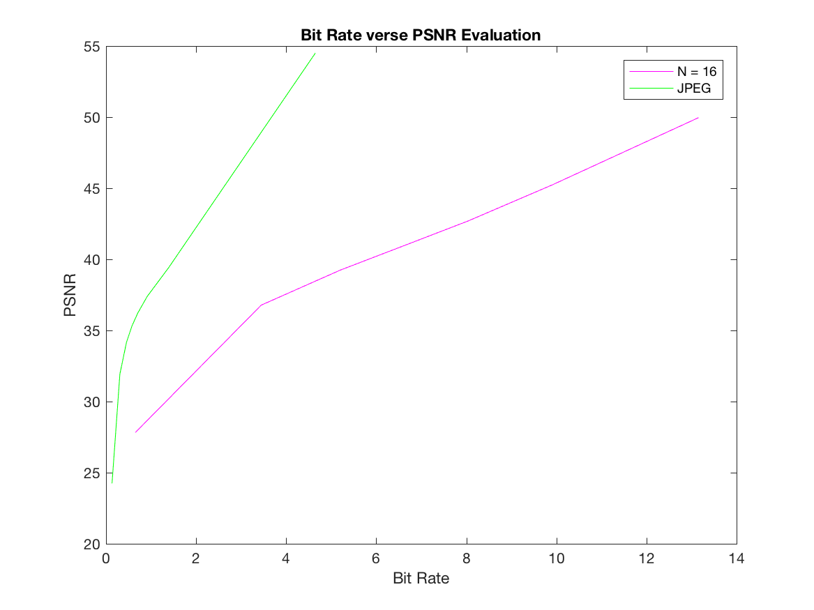
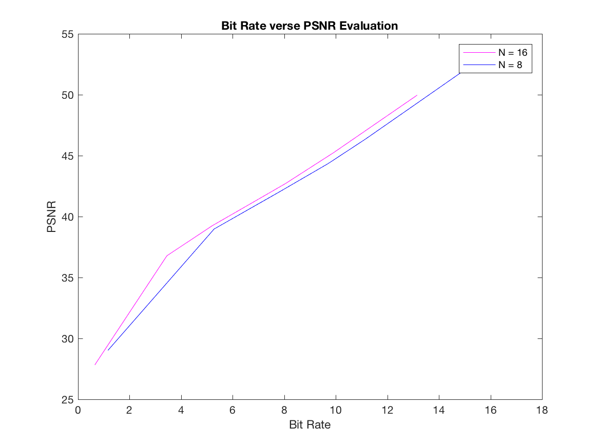

#### **[MultiMedia Telecommunication](http://www.xjtlu.edu.cn/en/find-a-programme/masters/msc-multimedia-telecommunications), M.S. Program @ [XJTLU](http://www.xjtlu.edu.cn/en/)**

# Image and Video Processing | EEE412

#### **Lab 04: Image Compression**

**Objectives:**

* To familiarize with the concepts of image compression.
* To develop some basic image compression tools. 


==**Professor:** Dr.Qiufeng Wang 
**Student:** Le Zhou, 1715218==

<br/>
<br/>
<br/>
<br/>
<br/>
<br/>
<br/>
<br/>
<br/>
<br/>
<br/>
<br/>

**Aven Le Zhou**
M.S. MMT@XJTLU
**&middot;** www.aven.cc **&middot;** Le.Zhou17@xjtlu.edu.cn

## Task 01: Huffman Compression and Decompression
### Huffman compression function design:
* **Build huffman tree and assign code**
	1. Count symbols and calculate probability;
	2. Sort symbols table by probability;
	3. Assign the first and second lowest probability symbols '0' and '1' respectively;
	4. Summrise the first two symbols' probability and resort the table: If the third symbol has higher probability, assign '1' and add '0' to previous two symbols, what is worth mention here is to combine char type code should be done with **strcat** instead of '**+**';
	5. Repeat step 4 recursively till the symbol with highest probability be assign with '0' or '1'; 
* **Obtain huffman dictionary:** Pair symbols and huffman code in to a NX2 cell array.
* **Compress image with huffman dictionary:** Loop through every pixel and assign huffman code respectively.
* **Calculate dictinary average length** with $ Average\_length = \sum_ ( probability * Huffman\_code\_length) $.
* **Calculate compression ration:** average length before compression is 8 bits, which makes the CR = 8/ average_length


```matlab
function [Huffman_dictionary,CR,imc] = Huffman_compress(im)

%count symbols and calculate probability
symbols = tabulate(im(:));

%delete 0 amount
symbols(symbols(:,2)==0,:)=[];

% sort by probability
symbols = sortrows(symbols,3);

%build Huffman tree and assign code
[rows,cols]=size(symbols);
code = cell(rows,1);
code{1} = '0';
code{2} = '1';

assigned_p_sum = symbols(1,3) + symbols(2,3);

for i = 3:rows
    j = i -1;
    if symbols(i,3) > assigned_p_sum
         code(i) = strcat('1',code(i));   
         code(1:j) = strcat('0',code(1:j));
    else
         code(i) = strcat('0',code(i));
         code(1:j) = strcat('1',code(1:j));
    end
    assigned_p_sum = assigned_p_sum + symbols(i,3);
end

% calculate dictinary average length
average_len = 0; 
for index = 1 : rows
    p = symbols(index,3) * 0.01;
    len = length(cell2mat(code(index)));
    average_len = average_len + p * len;
end

%prepare dictionary output
Huffman_dictionary = [num2cell(symbols(:,1)), code(:)];
Huffman_dictionary = sortrows(Huffman_dictionary,1);

% image compression
[im_rows,im_cols] = size(im);
imc = cell(im_rows,im_cols);

for m = 1:im_rows
    for n = 1:im_cols
        pixel_value = im(m,n);
        imc(m,n) = Huffman_dictionary(cell2mat(Huffman_dictionary(:,1)) == pixel_value,2);
    end
end

%calculate the compression ratio
CR = 8/average_len;

end
```
### Huffman decompression function design:
Loop through all pixels and compare each pixel with huffman dictionary,  then assign the matched symbols to pixel, what is worth mention here is function **cell2mat()** and **strcmp()**, one for convert cell to num and the latter one is to check if a pair of char type (or string type) data are equal to each other, '**==**' cannot be used here.

```matlab
function imo = Huffman_decompression(Huffman_dictionary,imc)

[rows,cols]=size(imc);
imo = zeros(rows,cols);

for i = 1 : rows
    for j = 1 : cols
        pixel_code = imc(i,j);
        imo(i,j) = cell2mat(Huffman_dictionary(strcmp(Huffman_dictionary(:,2),pixel_code),1));
    end
end
end
```
Genetate Qmat function: Calculate the Qmat(N,N) value first, initilize matrix, then fill in other values reversely.

```matlab
function Qmat = gen_qmat(N)
    Qmat = zeros(N);
    t = 1;s = 1;c = 0;
    while t < N
        s = s*2;
        t = t+s;
        c = c+1;
    end  
    Qmat(:) = s;
    for i = c:-1:1
        t = t - s;
        s = s/2;
        Qmat(1:t,1:t) = s;
    end
end
```
Run following code to compress and decompress N = 16 Qmat:

```matlab
clear;clc;

% generate Qmat
Qmat = gen_qmat(16);

% Huffman compression
[Huffman_dictionary,CR,imc] = Huffman_compress(Qmat);

% Huffman decompression 
imo = Huffman_decompression(Huffman_dictionary,imc);
```
**Results** will be obtained:
Huffman dictionary:

```matlab
>> Huffman_dictionary

Huffman_dictionary =
  5×2 cell array
  
    [ 1]    '0100'
    [ 2]    '0101'
    [ 4]    '00'  
    [ 8]    '1'   
    [16]    '011' 
```
 
 Compression ratio:
 
 ```matlab
 >> CR

CR =
    5.3195
 ```
 And compessed qmat/image, imc:
 
| 0100 | 0101 | 0101 | 00  | 00  | 00  | 00  | 1   | 1   | 1   | 1   | 1   | 1   | 1   | 1   | 011 |
|------|------|------|-----|-----|-----|-----|-----|-----|-----|-----|-----|-----|-----|-----|-----|
| 0101 | 0101 | 0101 | 00  | 00  | 00  | 00  | 1   | 1   | 1   | 1   | 1   | 1   | 1   | 1   | 011 |
| 0101 | 0101 | 0101 | 00  | 00  | 00  | 00  | 1   | 1   | 1   | 1   | 1   | 1   | 1   | 1   | 011 |
| 00   | 00   | 00   | 00  | 00  | 00  | 00  | 1   | 1   | 1   | 1   | 1   | 1   | 1   | 1   | 011 |
| 00   | 00   | 00   | 00  | 00  | 00  | 00  | 1   | 1   | 1   | 1   | 1   | 1   | 1   | 1   | 011 |
| 00   | 00   | 00   | 00  | 00  | 00  | 00  | 1   | 1   | 1   | 1   | 1   | 1   | 1   | 1   | 011 |
| 00   | 00   | 00   | 00  | 00  | 00  | 00  | 1   | 1   | 1   | 1   | 1   | 1   | 1   | 1   | 011 |
| 1    | 1    | 1    | 1   | 1   | 1   | 1   | 1   | 1   | 1   | 1   | 1   | 1   | 1   | 1   | 011 |
| 1    | 1    | 1    | 1   | 1   | 1   | 1   | 1   | 1   | 1   | 1   | 1   | 1   | 1   | 1   | 011 |
| 1    | 1    | 1    | 1   | 1   | 1   | 1   | 1   | 1   | 1   | 1   | 1   | 1   | 1   | 1   | 011 |
| 1    | 1    | 1    | 1   | 1   | 1   | 1   | 1   | 1   | 1   | 1   | 1   | 1   | 1   | 1   | 011 |
| 1    | 1    | 1    | 1   | 1   | 1   | 1   | 1   | 1   | 1   | 1   | 1   | 1   | 1   | 1   | 011 |
| 1    | 1    | 1    | 1   | 1   | 1   | 1   | 1   | 1   | 1   | 1   | 1   | 1   | 1   | 1   | 011 |
| 1    | 1    | 1    | 1   | 1   | 1   | 1   | 1   | 1   | 1   | 1   | 1   | 1   | 1   | 1   | 011 |
| 1    | 1    | 1    | 1   | 1   | 1   | 1   | 1   | 1   | 1   | 1   | 1   | 1   | 1   | 1   | 011 |
| 011  | 011  | 011  | 011 | 011 | 011 | 011 | 011 | 011 | 011 | 011 | 011 | 011 | 011 | 011 | 011 |

### **Observation and conclusion:**


## Task 02: Image Compression
### Image compression function design:
Follow all subtask and finish compression function:

* Evaluate the two-dimensional DCT of all the N X N non-overlapping blocks of the image im.  For block processing of image use function **blockproc** which needs to create block processing function first: 
```block_processing_fun = @(block_struct) some_function(block_struct.data,0.15)```
then process image block by block with function:
```blockproc(Input,blockSize, block_processing_fun) ```

* To convert the floating point numbers of the 2D-DCT into integer numbers, quantize each N X N block using formula: 
$$round(\frac{b_{ij}}{S*q_{ij}})$$
Where $b_{ij}$ is the ith row and jth column of the N X N 2D-DCT transformed block, whereas, $q_{ij}$ is the element of the quantization matrix NxN Qmat. And S is a scalar 
$$
S = \begin{cases}
\frac{100 - QP}{50},  & {QP > 50} \\\\
\frac{50}{QP}, & {QP \le 50}
\end{cases}
$$
and matlab function is:

```matlab
function S = scalar(QP)
    if QP > 50
        S = (100-QP)/50;
    else 
        S = 50/QP; 
    end
end
```
* Entropy/symbol encode.
* Save the entropy encoded vector as **file_name**, with function **csvwrite**.
* Evaluate bit rate(bit per pixel [bpp]) of compressed image and return as **rate**, rate here is the ration o f file size before and after compression.


```matlab
function [rate] = compress_im(im,Qmat,QP,N, file_name)

% a) 2D-DCT
fun = @(block_struct)dct2(block_struct.data);
im_dct2 = blockproc(im,[N N],fun);

% b) Quantize
S = scalar(QP);
fun1 = @(block_struct)round(block_struct.data./(S*Qmat));
im_integer = blockproc(im_dct2,[N N],fun1);

% c)Entropy/Symbol Encode
entropy_encode = entropy_enc(im_integer);

% d)Save/Write
csvwrite(file_name,entropy_encode);

% e)Calculate Bit Rate
[rows,cols] = size(im);
bits = fsize(file_name);
rate = bits*8/(rows*cols);

end
```
Compare with JPEG and Comment:

## Task 03: Image Decompression
### Image decompression function design:
* Read encoded entropy/symbols with function **csvread**
* Decode encoded entropy/symbols with function **entropy_dec**, and convert this 1D array to rows X cols dimension by **reshape** function 
* Inverse quantization, with block image processing function.
* Inverse DCT with block image processing function. 

```matlab
function [ imo ] = decompress_im( Qmat,QP,N,file_name,rows,cols )

% Read File
entropy_encode = csvread(file_name);

%Entropy/Symbol Decode
im_integer = entropy_dec(entropy_encode);
im_integer = reshape(im_integer,rows,cols);

%Reverse Quantize
S = scalar(QP);
fun1=@(block_struct)(S*Qmat).*block_struct.data;
im_dct2=blockproc(im_integer,[N N],fun1);

%Reverse 2D-DCT
fun2=@(block_struct)idct2(block_struct.data);
imo=blockproc(im_dct2,[N N],fun2);

imo=uint8(imo);

end
```
Comments:

## Task 04:
```matlab 
function [rate_PSNR] = Rate_PSNR(im,QP,N)
%genetate N Qmat
Qmat = gen_qmat(N);

%Get Image Size 
[rows,cols] = size(im);

% Compress
file_name = char('imc_N' + string(N) + '_QP' + string(QP) + '.dat');
rate = compress_im(im,Qmat,QP,N,file_name);

% Decompress
imo = decompress_im(Qmat,QP,N,file_name,rows,cols);
PSNR = psnr(im,imo,255);

% Save Figure of Comparision of Original and Recovered Image 
figure_name = char('images/t04/N' + string(N) + '_QP' + string(QP));
plot_name = char('N' + string(N) + '\_QP' + string(QP));
fig = figure('Name','Original vs. Recovered Image');
fig.OuterPosition = [100 100 1084 572];
subplot(1,2,1),imshow(im),title('Original Image');
subplot(1,2,2),imshow(imo),title(plot_name);
print(figure_name,'-dpng');

rate_PSNR = [rate, PSNR];
end
```

```matlab
clear;clc;

%Read Image 
im = imread('images/lenna512.bmp');

% Init Rate_PSNR
Rate_PSNR_16 = zeros(2,8);
Rate_PSNR_8 = zeros(2,8);
Rate_PSNR_jpg = zeros(2,8);

% Calculate Bit Rate and PSNR
i = 1;
while i <= 8 %loop through all QR
    QP = 1 + 14*(i-1);
    
%when N = 16
    N = 16;
    Rate_PSNR_16(:,i) = Rate_PSNR(im,QP,N);

%when N = 8
    N = 8;
    Rate_PSNR_8(:,i) = Rate_PSNR(im,QP,N);
    
%Use Jpeg Method     
    file_name = 'images/t04/lenna_jpeg_QP' + string(QP) + '.jpg';
    file_name = char(file_name);
    imwrite(im,file_name,'Quality',QP);
    im_jpeg = imread(file_name);
    Rate_PSNR_jpg(:,i) = [fsize(file_name)*8/(rows*cols),psnr(im,im_jpeg)];
   
    i = i + 1;
end

% Save Figure of Comparision of N = 16 and Jpeg method
t04_Rate_PSNR = figure('Name','Bit Rate verse PSNR Evaluation');
plot(Rate_PSNR_16(1,:),Rate_PSNR_16(2,:),'m',Rate_PSNR_jpg(1,:),Rate_PSNR_jpg(2,:),'g');
legend('N = 16','JPEG');title('Bit Rate verse PSNR Evaluation');
xlabel('Bit Rate');ylabel('PSNR');
print('images/t04_Rate_PSNR','-dpng');

% Save Figure of Comparision of N = 16 and N = 8
t04_Rate_PSNR2 = figure('Name','Bit Rate verse PSNR Evaluation');
plot(Rate_PSNR_16(1,:),Rate_PSNR_16(2,:),'m',Rate_PSNR_8(1,:),Rate_PSNR_8(2,:),'b');
legend('N = 16','N = 8');title('Bit Rate verse PSNR Evaluation');
xlabel('Bit Rate');ylabel('PSNR');
print('images/t04_Rate_PSNR2','-dpng');
```


```matlab

```

N = 16

| QP         | 1 | 15 | 29 | 43 | 57 | 71 | 85 | 99 |
|------------|---|----|----|:--:|----|----|----|----|
| **Rate[bpp]** | 0.6515 | 3.4470 | 5.1993 | 6.6813 | 8.0453 | 9.9103 | 13.1551 | 27.0295 |
| **PSNR[dB]**   | 27.8241 | 36.7812 | 39.2396 | 41.0414 | 42.7052 | 45.2407 | 49.9648 | Inf |

JPEG

| QP        | 1       | 15      | 29      | 43      | 57      | 71      | 85      | 99      |
|-----------|---------|---------|---------|---------|---------|---------|---------|---------|
| **Rate[bpp]** | 0.1335  | 0.3076  | 0.4530  | 0.5776  | 0.7049  | 0.9145  | 1.3861  | 4.6481  |
| **PSNR[dB]**  | 24.2411 | 31.9271 | 34.1452 | 35.3240 | 36.2201 | 37.3926 | 39.3942 | 54.5089 |



N = 8

| QP | 1       | 15      | 29      | 43      | 57      | 71      | 85      | 99      |
|----|---------|---------|---------|---------|---------|---------|---------|---------|
|   **Rate[bpp]**  | 1.1597  | 5.2786  | 7.8274  | 9.6916  | 11.1232 | 13.0727 | 16.3927 | 30.3493 |
|  **PSNR[dB]**   | 29.0170 | 38.9765 | 42.0455 | 44.3350 | 46.3198 | 49.1883 | 54.0898 | Inf |




