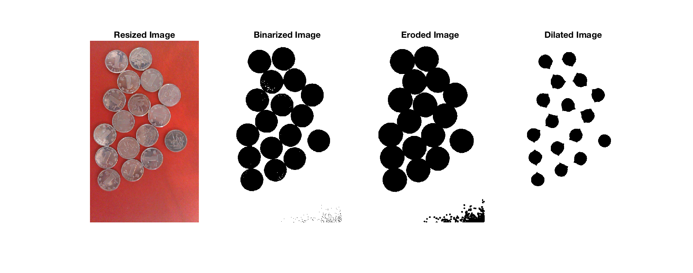

#### [MultiMedia Telecommunication](http://www.xjtlu.edu.cn/en/find-a-programme/masters/msc-multimedia-telecommunications), M.S. Program @ [XJTLU](http://www.xjtlu.edu.cn/en/)

# Image and Video Processing | EEE412

#### **Lab 05: Morphological Operation**


==**Professor:** Dr.Qiufeng Wang 
**Student:** Le Zhou, 1715218==


<br/>
<br/>
<br/>
<br/>
<br/>
<br/>
<br/>
<br/>
<br/>
<br/>
<br/>
<br/>

**Aven Le Zhou**
M.S. MMT@XJTLU
**&middot;** www.aven.cc **&middot;** Le.Zhou17@xjtlu.edu.cn

## Task 01: Count the coins.
#### Algorthm Design:
For Counting the image, [bwlabel()](https://cn.mathworks.com/help/images/ref/bwlabel.html) function is considered and image needs to be preprocessed to fulfill the requirement of the counting process. 

**Preprocess process:**
1. Resize the image to a fairish size, eg. 648*388 in this implementation.
2. Binarize image:
	* Switch color mode from 'rgb' to 'hsb'.
	* Get 'hue' value.
	* Assign '1' to pixels with hue value greater than 0.5 and '0' to the rest. 
3. Erode image to fill the 'holes'/noises.
4. Dilate image to separate the 'coins'
 
**Count process:**
Revert the preprocessed image (switch font and back color) and count the coins with bwlabel() function.

Matlab implementation:

```matlab
clear all;close all;

% read and resize image
im_coins_original = imread('images/Coins.jpg');
im_coins = imresize(im_coins_original,0.25);

% binarize image by evaluating hue value
im_hsv = rgb2hsv(im_coins);
im_hue = im_hsv(:,:,2);
im = im_hue > 0.5;

% erosion, fill holes
se = strel('disk',3,0);
im_erosion = imerode(im,se);

% dilation, delete noise 
se = strel('disk',20,0);
im_dilation = imdilate(im_erosion,se);

% plot out all image through process
t1_fig = figure('Name',"Process");
t1_fig.OuterPosition = [100 100 880 420];
subplot(1,4,1),imshow(im_coins),title("Resized Image");
subplot(1,4,2),imshow(im),title("Binarized Image");
subplot(1,4,3),imshow(im_erosion),title("Eroded Image");
subplot(1,4,4),imshow(im_dilation),title("Dilated Image");
print('images/t1_fig','-dpng');

% count numbers
[~, num] = bwlabel(~im_dilation);
num
```
The result will be: 

```matlab 

num =

    17
```
And this figure generated can describle the process (especially the image preprocessing part):


## Task02: Car License Plate Recognition.


**Binarize image algorthm design:**
1. Convert image from rgb mode to grayscale
2. Binarize the image: if the pixel gray value is greater than threshold set it to '1' else '0'

**Matlab implementation:**
What worth mention here is I didn't figure out the ``im_binary = im > threshold`` cannot work, I sucessfully made it work for task one but not here.

```matlab
function im_binary= binarize(im,threshold)
[r,c,dim] = size(im);
% Convert RGB to Gray Scale
if dim == 3
    im = rgb2gray(im);
else
  sprintf('im has to be rgb image');
end
% Binarize Image
im_binary = zeros(r,c);
 for i = 1:r
   for j = 1:c
         if(im(i,j)) < threshold
             im_binary(i,j) = 0;
         else
             im_binary(i,j) = 1;
         end
     end
 end
% im_binary = im > threshold;
end
```

**Function one (subtask 2.1) algorthm design:**
1. Split license and templete image into charactors: First, erode the image, then split the image with segmentation function.
2. Build dictionary: match charctors and images segments
3. Detection: Check splited license images one by one, and erode each splited license image with splited templete images as structure element.  If the result shows ture, which means the matched templete images is found, then add the matched templete image to final recognition result.

**Matlab implementation:**

```matlab
function str = detect_car_license_plate_v1(im,im_temp)

% Erode template
SE_temp = strel('square',3);
im_temp_eroded = imerode(im_temp,SE_temp);

% Split license
im_num = segmentation(im,'license_');
% Spilt the templates
temp_num = segmentation(im_temp_eroded,'temp_');

% Based on the segmentation random order design the dictonary
character=char('A','0','5','K','U','6','1','B','V','L','W','2','7',...
    'M','C','3','8','X','D','N','4','9','Y','O','E','Z','F','P','G',...
    'Q','H','R','S','I','J','T');

% Detection
count = 1;
for i = 1:im_num
    % Read splited image
    im_splited = im2double(imread(sprintf('license_%d.bmp',i)));
    for j = 1:temp_num
        % Read splited templates
        im_temp_splited = im2double(imread(sprintf('temp_%d.bmp',j)));
        % Erosion
        result = imerode(im_splited,im_temp_splited);
        % Find the matched character
        if(~isempty(find(result == 1, 1)))
            detect(count) = j;
            count = count+1;
        end
    end
end

str = character(detect);
end
```

**Function 02 (subtask 2.2) algorthm design:**
1. Split license and templete image with segmentation function.
2. Build dictionary and match the segments and charactor
3. Construct structure elements
4. Generate and save fg and bg, erode the splited templete image and save as fg, first dilate then erode and substract results and save as bg 
5. Detection: Check splited license images one by one, and hit-miss each splited license image with fg, bg pairs from splited templete images as structure element.  If the result shows ture, which means the matched templete images is found, then add the matched templete image to final recognition result.

**Matlab implementation:**

```matlab
function str = detect_car_license_plate_v2(im,im_temp)

% Split license and templete
im_num = segmentation(im,'license2_');
temp_num = segmentation(im_temp,'temp_fg_');

% Build dictionary
character=char('A','0','5','K','U','6','1','B','V','L','W','2','7',...
    'M','C','3','8','X','D','N','4','9','Y','O','E','Z','F','P','G',...
    'Q','H','R','S','I','J','T');

% Structuring elements 
SE1 = strel('square',3);
SE2 = strel('square',5);

% Generate and save fg and bg
for k=1:temp_num
    im_temp_splited = double(imread(sprintf('temp_fg_%d.bmp',k)));
    im_fg = imerode(im_temp_splited,SE1);
    imwrite(im_fg,strcat('temp_fg_',int2str(k),'.bmp'));
    
    im_bg_1 = imdilate(im_temp_splited,SE2);
    im_bg_2 = imerode(im_bg_1,SE1);
    im_bg = im_bg_1-im_bg_2;
    imwrite(im_bg,strcat('temp_bg_',int2str(k),'.bmp'));
end

% detection
count=1;
for i=1:im_num
    % Read splited image
    im_splited = im2double(imread(sprintf('license2_%d.bmp',i)));
    for j=1:temp_num
        fg = im2double(imread(sprintf('temp_fg_%d.bmp',j)));
        bg = im2double(imread(sprintf('temp_bg_%d.bmp',j)));
        % Hit-miss
        result = bwhitmiss(im_splited,fg,bg);
        [row,col] = size(im_splited);
        % Find match
        if(result(floor(row/2),floor(col/2))==1)
            detect(count)=j;
            count=count+1;
        end
    end
end

str = character(detect);
end
```
**Main program design:**
1. Preprocess: Get the threshold value and use binarize function implemented previouly. Then crop out the Chinese charactor.
2. Reconganition process: Run the function implemented previously.

```matlab
clc;clear;close all;

%%% Image Preprocess

% read image
im = imread('images/car_license_plate.png');
im_temp = imread('images/alphanumeric_templates.png');
% Get the threshold value
thresh = graythresh(im);
thresh_temp = graythresh(im_temp);
% Binarize image
im = binarize(im,thresh*255);
im_temp = binarize(im_temp,thresh_temp*255);
% Crop out Chinese char
im = imcrop(im,[160,40,460,80]);
im_temp = imcrop(im_temp,[45,40,1040,490]);

figure;imshow(im);
figure;imshow(im_temp);

%%% Image Reconganition
% task 01
license_01 = detect_car_license_plate_v1(im,im_temp)
% task 02
license_02 = detect_car_license_plate_v2(im,im_temp)
```

Results shows like:

```matlab
license_01 =

  16×1 char array

    'V'
    'E'
    'F'
    'I'
    'K'
    'I'
    'F'
    'I'
    'H'
    'I'
    '1'
    'I'
    'O'
    'Q'
    'O'
    'C'


license_02 =

  8×1 char array

    'E'
    'K'
    'F'
    'H'
    '1'
    'Q'
    'O'
    'C'
```
**Comments:**
When uses the function detect\_car\_license\_plate\_v1(), it's clear that the program is giving the wrong answer. When the letter is 'E', the program finds 'E','F','I' and adds them in one by one; When the letter is 'K', 'K' and 'I' is added in; When the letter is 'H', 'H' and 'I' is added in the results, .etc. In general, if the the letter on license 'contains' other letters, those letters will taken as result due to the defect of this method, because, take 'E', 'F' and 'I' as example, the erosion results will all be true for 'E' no matter the structure element is 'E', 'F' or 'I'.
When uses the function detect\_car\_license\_plate\_v2(), the result turns out correct, it's because hit-miss function is used, and with two structure elements to detecct the letter, the issue in detect\_car\_license\_plate\_v1() no longer exsits. All letters have only one perfect match.